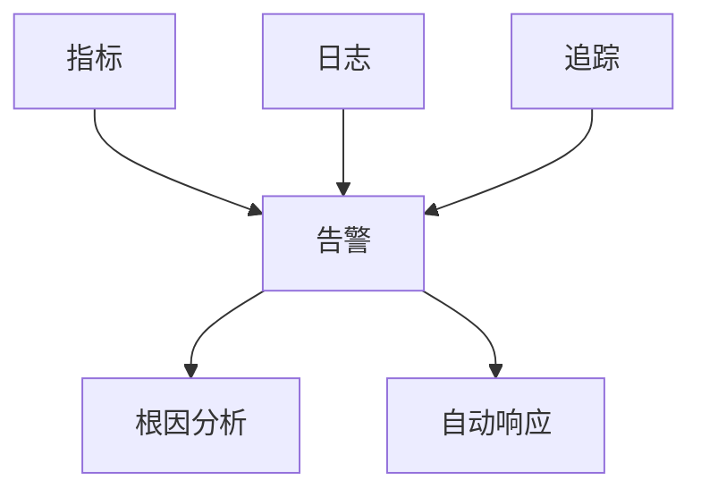

# 监控模型理论创新与递归推理

## 1. 理论创新与差异化

- **递归监控AST结构**：支持指标、日志、追踪、告警等多层嵌套与组合，表达复杂监控体系。
- **多维数据与依赖推理**：引入多维指标、日志流、追踪链递归解析、告警依赖等机制。
- **AI自动化**：集成AI辅助异常检测、根因分析、告警降噪、自动修复建议。
- **工程难点与创新**：解决跨系统数据关联、异常泛滥、根因定位、自动化响应等工程难题。

## 2. 递归推理伪代码

```python
# 递归推理：自动推导告警依赖链与根因分析

def infer_alert_dependencies(alert):
    deps = set(alert.dependencies)
    for sub in alert.sub_alerts:
        deps.update(infer_alert_dependencies(sub))
    return deps

# AI辅助根因分析

def ai_root_cause(logs, metrics, traces):
    return ai_model.suggest_root_cause(logs, metrics, traces)
```

## 3. 典型递归流程图



## 4. 实际代码片段（AI辅助异常检测与降噪）

```python
# AI辅助异常检测

def ai_detect_anomaly(metrics, logs):
    return ai_model.detect_anomaly(metrics, logs)

# 告警降噪

def alert_deduplication(alerts):
    deduped = []
    seen = set()
    for alert in alerts:
        key = (alert.type, alert.target)
        if key not in seen:
            deduped.append(alert)
            seen.add(key)
    return deduped
```

## 5. 工程难点与创新解决方案

- **跨系统数据递归关联**：自动发现指标、日志、追踪、告警间的递归依赖。
- **根因定位与自动响应**：AI辅助根因分析，自动生成响应与修复建议。
- **异常泛滥与降噪**：递归聚合告警、降噪、优先级排序，防止告警风暴。
- **AI驱动的监控优化**：利用AI分析历史监控数据，自动优化监控规则与告警策略。

## 6. 行业映射与案例

- 金融：多层级指标与告警递归建模，AI辅助异常检测与根因定位。
- 云原生：分布式追踪、日志流与指标递归聚合，AI自动生成监控仪表盘。
- 工业：设备日志、传感器指标递归监控，AI辅助异常检测与自动响应。

---

> 本文档持续递归完善，欢迎补充更多创新理论、推理伪代码、流程图与行业案例。
