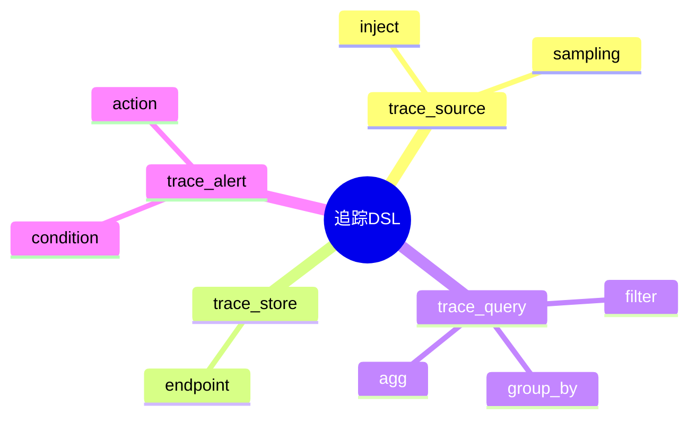

# 追踪模型DSL草案

## 1. 设计目标

- 用声明式语法描述追踪采集、注入、存储、查询、分析等流程
- 支持多源分布式追踪统一建模
- 便于自动生成采集/分析配置

## 2. 基本语法结构

```dsl
trace_source "serviceA" {
  inject = true
  sampling = "probabilistic(0.1)"
}

trace_store "jaeger" {
  endpoint = "http://jaeger:14268/api/traces"
}

trace_query "slow_traces" {
  filter = "duration > 1000ms"
  group_by = "service"
  agg = "count"
}
```

## 3. 关键元素

- trace_source：追踪源定义
- trace_store：追踪存储目标
- trace_query：追踪查询与聚合
- trace_alert：追踪告警规则

---

## 4. 示例

```dsl
trace_source "gateway" {
  inject = true
  sampling = "always_on"
}

trace_store "zipkin" {
  endpoint = "http://zipkin:9411/api/v2/spans"
}

trace_query "error_traces" {
  filter = "status == 'ERROR'"
  output = "alert"
}
```

---

## 5. 与主流标准的映射

| DSL元素      | OpenTracing | OpenTelemetry | Jaeger/Zipkin配置 |
|--------------|-------------|---------------|-------------------|
| trace_source | tracer      | tracer        | collector         |
| trace_store  | reporter    | exporter      | storage           |
| trace_query  | n/a         | processor     | query             |

---

## 6. 递归扩展建议

- 支持多级追踪聚合与转发
- 追踪与日志、指标的统一DSL
- 追踪采集与AI分析的集成

---

## 7. 追踪DSL关键元素表格

| 元素          | 说明           | 典型属性           |
|---------------|----------------|--------------------|
| trace_source  | 追踪源定义     | inject, sampling   |
| trace_store   | 存储目标       | endpoint           |
| trace_query   | 查询与聚合     | filter, group_by   |
| trace_alert   | 告警规则       | condition, action  |

---

## 8. 追踪DSL语法思维导图（Mermaid）



---

## 9. 形式化DSL推理片段

**推论：**  
若 trace_source、trace_store、trace_query、trace_alert 语法均具备完备性，则任意追踪采集与分析流程均可通过DSL自动生成配置与推理链路。

**证明思路：**  

- 每个环节均可形式化为DSL声明；
- DSL可自动转化为采集/分析/告警配置；
- 组合DSL可推导出完整的追踪处理链路。
