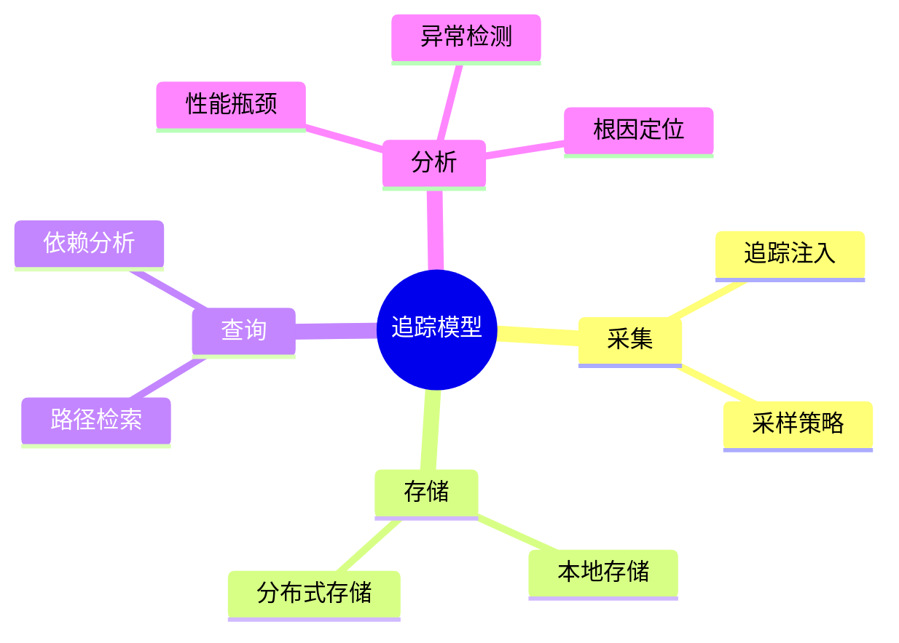

# 追踪模型理论探讨

## 1. 形式化目标

- 明确分布式追踪数据的结构、语义与生命周期
- 支持追踪采集、存储、查询、分析的自动化与标准化
- 为分布式系统的性能分析、故障定位、依赖关系建模等提供形式化基础

## 2. 核心概念

- Trace（追踪）
- Span（跨度）
- Trace Context（追踪上下文）
- Parent/Child 关系
- 采样（Sampling）

## 3. 已有标准

- OpenTracing
- OpenTelemetry Tracing
- Zipkin
- Jaeger

## 4. 可行性分析

- Trace/Span 结构天然适合树/图建模
- 采集、传递、存储、查询、分析流程可形式化建模
- 与日志、指标等可统一为可观测性模型

## 5. 自动化价值

- 自动生成追踪采集/注入/导出配置
- 自动化性能瓶颈检测与依赖分析
- 追踪与AI结合实现智能根因定位、异常检测

## 6. 与AI结合点

- 追踪异常检测与聚类
- 智能瓶颈分析与依赖链路优化
- 追踪驱动的根因分析与预测

## 7. 递归细分方向

- 追踪采集（Collection）
- 追踪注入（Injection）
- 追踪存储（Storage）
- 追踪查询（Query）
- 追踪分析（Analysis）

---

## 8. 常见追踪元素表格

| 元素         | 说明           | 典型字段                |
|--------------|----------------|-------------------------|
| Trace        | 一次完整请求链 | trace_id, spans         |
| Span         | 单个操作片段   | span_id, parent_id, name|
| Context      | 追踪上下文     | trace_id, span_id       |
| Attribute    | 额外属性       | key, value              |
| Event        | 事件           | timestamp, description  |

---

## 9. 追踪建模与分析思维导图（Mermaid）

---

## 10. 形式化推理/论证片段

**定理：**  
若追踪采集、注入、存储、查询、分析各环节均可形式化建模，则分布式追踪系统具备可验证性与可自动化推理能力。

**证明思路：**  

1. 采集与注入可用DSL描述上下文传递与采样策略；
2. 存储与查询可形式化为树/图结构与查询算子；
3. 分析可归约为链路遍历与模式识别；
4. 整体流程可组合为可验证的追踪链路。

## 理论确定性与论证推理

在追踪模型领域，理论确定性是实现分布式追踪自动化、性能分析、故障定位的基础。以 OpenTracing、OpenTelemetry、Zipkin、Jaeger 等主流追踪平台为例：

1. **形式化定义**  
   追踪结构、Span关系、上下文传递、采样策略等均有标准化描述和配置语言。

2. **公理化系统**  
   通过追踪引擎和分析器，实现追踪逻辑的自动推理与性能分析。

3. **类型安全**  
   追踪ID、Span属性、上下文字段等类型严格定义，防止追踪错误。

4. **可证明性**  
   关键属性如追踪完整性、性能分析准确性等可通过验证和测试进行形式化证明。

这些理论基础为追踪模型的自动化配置、性能分析和故障定位提供了理论支撑。
