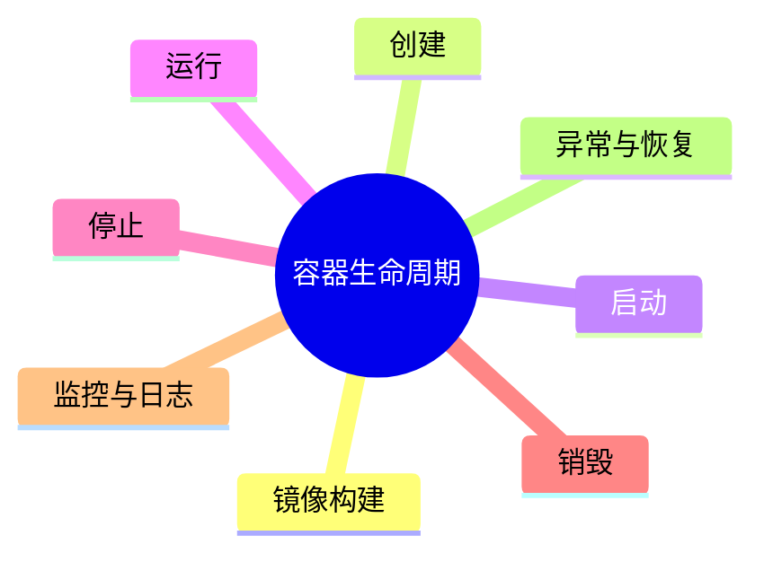

# 容器建模理论探讨

## 1. 形式化目标

- 以结构化方式描述容器的镜像、资源、环境、生命周期、依赖等。
- 支持多种容器（Docker、OCI等）统一建模。
- 便于自动生成容器配置、部署脚本、监控与测试用例等。

## 2. 核心概念

- **镜像（Image）**：容器运行的基础。
- **资源限制**：CPU、内存、存储等。
- **环境变量**：配置注入。
- **生命周期**：创建、启动、停止、销毁。
- **依赖与网络**：容器间依赖、网络配置。

## 3. 已有标准

- Dockerfile、docker-compose
- OCI容器规范
- Kubernetes Pod/Container

## 4. 可行性分析

- 容器建模结构化强，标准化程度高，适合DSL抽象。
- 可自动生成容器配置、部署脚本、监控等。
- 易于与AI结合进行资源优化、依赖推理、异常检测。

## 5. 自动化价值

- 降低手工配置和维护容器的成本。
- 提高部署一致性和可复现性。
- 支持自动化运维和弹性伸缩。

## 6. 与AI结合点

- 智能补全资源配置、依赖关系。
- 自动推理容器拓扑、网络策略。
- 智能生成扩缩容、容灾建议。

---

## 7. 常见容器特性一览（表格）

| 特性         | 说明                 | 典型场景           |
|--------------|----------------------|--------------------|
| 镜像         | 运行环境基础         | 应用部署、CI/CD    |
| 资源限制     | CPU/内存/存储配额    | 多租户、弹性伸缩   |
| 环境变量     | 配置注入             | 多环境部署         |
| 生命周期     | 启动/停止/销毁       | 自动化运维         |
| 网络         | 端口映射、服务发现   | 微服务、集群       |
| 存储         | 卷挂载、持久化       | 数据库、日志       |

---

## 8. 容器生命周期思维导图

---

## 9. 形式化推理/证明片段

**定理（资源隔离性）**：
若容器A、B的资源限制互不重叠，则A、B运行互不干扰。

*证明思路*：
设A、B分别分配独立CPU/内存cgroup，调度器保证资源独占，则互不影响。

**推论（依赖可达性）**：
若容器依赖图为连通图，则所有服务可达，系统可用。

## 理论确定性与论证推理

在容器建模领域，理论确定性是实现容器自动化部署、资源管理、生命周期控制的基础。以 Docker、Kubernetes、OCI、containerd 等主流容器平台为例：

1. **形式化定义**  
   容器镜像、资源配置、生命周期、网络策略等均有标准化描述和配置语言。

2. **公理化系统**  
   通过容器编排和资源调度，实现容器逻辑的自动推理与资源优化。

3. **类型安全**  
   容器配置、资源限制、环境变量等类型严格定义，防止容器运行错误。

4. **可证明性**  
   关键属性如资源隔离、服务可达性等可通过验证和测试进行形式化证明。

这些理论基础为容器建模的自动化配置、资源管理和生命周期控制提供了理论支撑。

## 理论确定性与论证推理（递归扩展版）

### 1. 形式化定义（递归细化）

#### 1.1 容器镜像系统

- **顶层**：采用 OCI（Open Container Initiative）标准、Docker Image 格式等标准化容器镜像定义
- **子层**：
  - **基础镜像**：FROM 指令，支持多阶段构建，结合 Alpine、Ubuntu、CentOS 等基础镜像
  - **层缓存系统**：Layer Caching，支持增量构建和缓存优化，结合 Docker BuildKit
  - **镜像签名**：Image Signing，支持镜像完整性验证，结合 Notary、Cosign
  - **镜像扫描**：Image Scanning，支持安全漏洞检测，结合 Trivy、Clair、Snyk

#### 1.2 容器资源管理系统

- **CPU资源**：CPU shares、CPU quota、CPU sets，支持 CPU 限制和调度
- **内存资源**：Memory limit、Memory reservation、Memory swap，支持内存限制和管理
- **存储资源**：Storage driver、Volume mounts、Storage quotas，支持存储隔离和管理
- **网络资源**：Network namespace、Port mapping、Network policies，支持网络隔离和通信

#### 1.3 容器生命周期系统

- **创建阶段**：Container creation，支持容器实例化，结合 containerd、CRI-O
- **启动阶段**：Container startup，支持容器初始化，结合 Entrypoint、CMD
- **运行阶段**：Container runtime，支持容器运行监控，结合 cAdvisor、Prometheus
- **停止阶段**：Container shutdown，支持优雅关闭，结合 SIGTERM、SIGKILL

### 2. 公理化系统（递归细化）

#### 2.1 容器调度推理引擎

- **资源调度推理**：基于资源需求自动调度容器到合适的节点
- **亲和性推理**：基于亲和性规则自动调度容器，如节点亲和性、Pod亲和性
- **反亲和性推理**：基于反亲和性规则避免容器冲突，如Pod反亲和性、节点反亲和性

#### 2.2 容器编排推理引擎

- **服务发现推理**：自动推导容器间的服务发现关系
- **负载均衡推理**：自动推导负载均衡策略，如轮询、最少连接、IP哈希等
- **扩缩容推理**：基于负载情况自动推导扩缩容策略

#### 2.3 容器安全推理引擎

- **安全策略推理**：自动推导容器安全策略，如网络策略、安全上下文等
- **权限推理**：基于最小权限原则自动推导容器权限
- **漏洞检测推理**：自动检测容器镜像中的安全漏洞

### 3. 类型安全（递归细化）

#### 3.1 容器配置类型安全

- **镜像类型安全**：确保镜像格式的正确性，如OCI格式、Docker格式等
- **资源类型安全**：确保资源配置的正确性，如CPU单位、内存单位等
- **网络类型安全**：确保网络配置的正确性，如端口号、IP地址等

#### 3.2 容器运行时类型安全

- **进程类型安全**：确保容器进程的正确性，如PID namespace、进程树等
- **文件系统类型安全**：确保文件系统的正确性，如挂载点、权限等
- **网络类型安全**：确保网络通信的正确性，如网络接口、路由等

#### 3.3 容器编排类型安全

- **Pod类型安全**：确保Pod配置的正确性，如容器列表、共享资源等
- **服务类型安全**：确保服务配置的正确性，如服务端口、选择器等
- **部署类型安全**：确保部署配置的正确性，如副本数、更新策略等

### 4. 可证明性（递归细化）

#### 4.1 容器隔离性证明

- **资源隔离**：通过资源监控验证容器间的资源隔离
- **网络隔离**：通过网络测试验证容器间的网络隔离
- **文件系统隔离**：通过文件系统测试验证容器间的文件系统隔离

#### 4.2 容器性能证明

- **启动性能**：通过启动时间测试验证容器的启动性能
- **运行性能**：通过性能测试验证容器的运行性能
- **资源利用率**：通过资源监控验证容器的资源利用率

#### 4.3 容器可靠性证明

- **故障恢复**：通过故障测试验证容器的故障恢复能力
- **数据持久性**：通过数据测试验证容器的数据持久性
- **服务可用性**：通过可用性测试验证容器的服务可用性

### 5. 最新开源框架集成

#### 5.1 Docker生态系统

- **Docker Engine**：容器运行时引擎
- **Docker Compose**：多容器应用编排
- **Docker Swarm**：容器集群管理
- **Docker Hub**：容器镜像仓库
- **Docker Desktop**：桌面容器环境

#### 5.2 Kubernetes生态系统

- **Kubernetes Core**：容器编排平台
- **Kubernetes API Server**：集群API服务器
- **Kubernetes Scheduler**：容器调度器
- **Kubernetes Controller Manager**：控制器管理器
- **Kubernetes Kubelet**：节点代理

#### 5.3 容器运行时生态系统

- **containerd**：容器运行时
- **CRI-O**：轻量级容器运行时
- **runc**：容器运行时
- **gVisor**：安全容器运行时
- **Kata Containers**：虚拟化容器运行时

### 6. 工程实践案例

#### 6.1 微服务容器化

- **服务拆分**：将单体应用拆分为多个微服务容器
- **服务发现**：通过服务注册和发现实现容器间通信
- **负载均衡**：通过负载均衡器实现容器负载分发
- **配置管理**：通过配置中心实现容器配置管理

#### 6.2 云原生容器化

- **容器编排**：通过Kubernetes实现容器编排和管理
- **自动扩缩容**：通过HPA实现容器自动扩缩容
- **服务网格**：通过Istio实现容器服务网格
- **监控告警**：通过Prometheus实现容器监控告警

#### 6.3 容器安全实践

- **镜像安全**：通过镜像扫描实现容器镜像安全
- **运行时安全**：通过安全策略实现容器运行时安全
- **网络安全**：通过网络策略实现容器网络安全
- **数据安全**：通过加密存储实现容器数据安全
