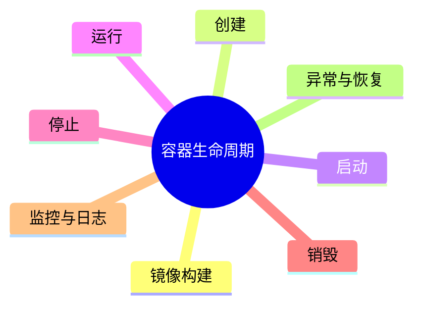

# 容器建模理论探讨

## 1. 形式化目标

- 以结构化方式描述容器的镜像、资源、环境、生命周期、依赖等。
- 支持多种容器（Docker、OCI等）统一建模。
- 便于自动生成容器配置、部署脚本、监控与测试用例等。

## 2. 核心概念

- **镜像（Image）**：容器运行的基础。
- **资源限制**：CPU、内存、存储等。
- **环境变量**：配置注入。
- **生命周期**：创建、启动、停止、销毁。
- **依赖与网络**：容器间依赖、网络配置。

## 3. 已有标准

- Dockerfile、docker-compose
- OCI容器规范
- Kubernetes Pod/Container

## 4. 可行性分析

- 容器建模结构化强，标准化程度高，适合DSL抽象。
- 可自动生成容器配置、部署脚本、监控等。
- 易于与AI结合进行资源优化、依赖推理、异常检测。

## 5. 自动化价值

- 降低手工配置和维护容器的成本。
- 提高部署一致性和可复现性。
- 支持自动化运维和弹性伸缩。

## 6. 与AI结合点

- 智能补全资源配置、依赖关系。
- 自动推理容器拓扑、网络策略。
- 智能生成扩缩容、容灾建议。

---

## 7. 常见容器特性一览（表格）

| 特性         | 说明                 | 典型场景           |
|--------------|----------------------|--------------------|
| 镜像         | 运行环境基础         | 应用部署、CI/CD    |
| 资源限制     | CPU/内存/存储配额    | 多租户、弹性伸缩   |
| 环境变量     | 配置注入             | 多环境部署         |
| 生命周期     | 启动/停止/销毁       | 自动化运维         |
| 网络         | 端口映射、服务发现   | 微服务、集群       |
| 存储         | 卷挂载、持久化       | 数据库、日志       |

---

## 8. 容器生命周期思维导图

---

## 9. 形式化推理/证明片段

**定理（资源隔离性）**：
若容器A、B的资源限制互不重叠，则A、B运行互不干扰。

*证明思路*：
设A、B分别分配独立CPU/内存cgroup，调度器保证资源独占，则互不影响。

**推论（依赖可达性）**：
若容器依赖图为连通图，则所有服务可达，系统可用。
