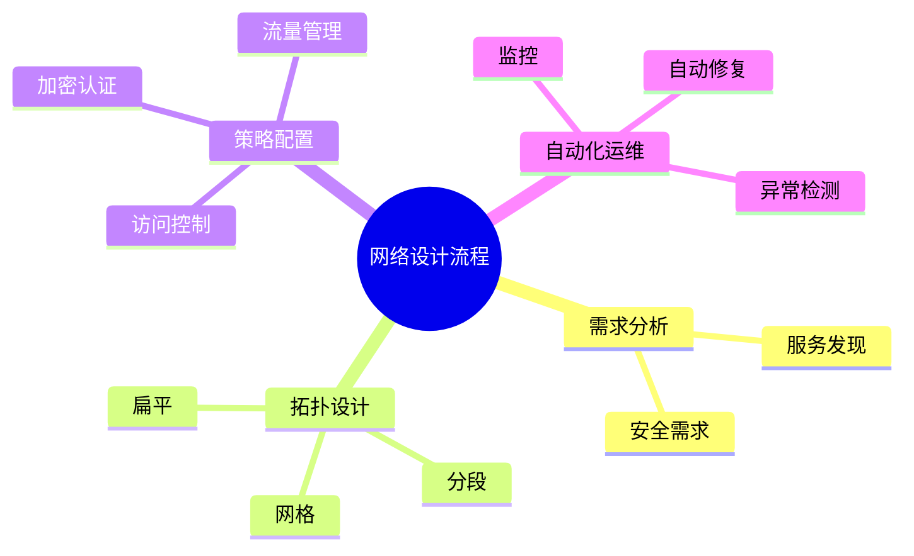

# 网络建模理论探讨

## 1. 形式化目标

- 以结构化方式描述服务间通信、网络拓扑、策略、隔离、服务发现等。
- 支持多种网络模型（扁平、分段、服务网格等）统一建模。
- 便于自动生成网络配置、策略、监控与测试用例等。

## 2. 核心概念

- **服务发现**：DNS、注册中心、负载均衡。
- **网络策略**：访问控制、隔离、分区。
- **拓扑结构**：扁平、分段、网格、Overlay等。
- **流量管理**：限流、熔断、路由、镜像。
- **安全与加密**：TLS、认证、零信任。

## 3. 已有标准

- Kubernetes Service/Ingress/NetworkPolicy
- Istio、Linkerd（服务网格）
- Calico、Cilium（CNI插件）

## 4. 可行性分析

- 网络建模结构化强，标准化程度高，适合DSL抽象。
- 可自动生成网络配置、策略、监控等。
- 易于与AI结合进行拓扑优化、异常检测、自动修复。

## 5. 自动化价值

- 降低手工配置和维护网络的成本。
- 提高安全性、可观测性和弹性。
- 支持自动化流量管理和异常恢复。

## 6. 与AI结合点

- 智能补全网络策略、服务发现。
- 自动推理拓扑瓶颈、异常路径。
- 智能生成安全加固与流量优化建议。

---

## 7. 常见网络特性一览（表格）

| 特性         | 说明                 | 典型场景           |
|--------------|----------------------|--------------------|
| 服务发现     | DNS/注册中心         | 微服务、集群       |
| 负载均衡     | 流量分配、健康检查   | API网关、LB        |
| 网络策略     | 访问控制、隔离       | 多租户、分区       |
| 拓扑结构     | 扁平/分段/网格      | 数据中心、云原生   |
| 流量管理     | 路由、限流、熔断     | 灰度发布、弹性伸缩 |
| 安全加密     | TLS、认证、零信任    | 金融、政务         |

---

## 8. 网络设计流程思维导图

---

## 9. 形式化推理/证明片段

**定理（网络连通性）**：
若服务间网络拓扑为连通图，则任意服务对均可通信。

*证明思路*：
对网络拓扑做连通性分析，若所有节点间存在路径，则连通。

**推论（策略隔离性）**：
若网络策略禁止A->B流量，则A无法访问B，实现隔离。

## 理论确定性与论证推理

在网络建模领域，理论确定性是实现网络自动化配置、安全策略、流量管理的基础。以 Kubernetes、Istio、Calico、Cilium、Linkerd 等主流网络平台为例：

1. **形式化定义**  
   网络拓扑、服务发现、流量策略、安全规则等均有标准化描述和配置语言。

2. **公理化系统**  
   通过网络策略和服务网格，实现网络逻辑的自动推理与流量控制。

3. **类型安全**  
   网络配置、策略规则、服务地址等类型严格定义，防止网络通信错误。

4. **可证明性**  
   关键属性如网络连通性、策略隔离性等可通过验证和测试进行形式化证明。

这些理论基础为网络建模的自动化配置、安全管理和流量控制提供了理论支撑。
