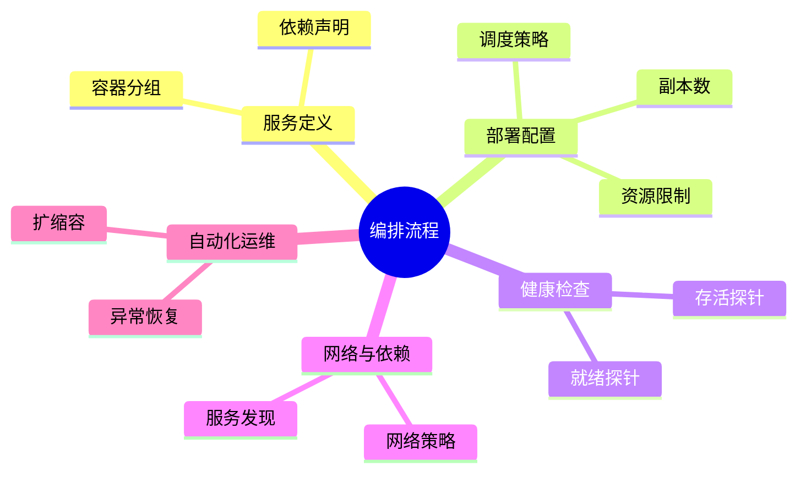

# 编排建模理论探讨

## 1. 形式化目标

- 以结构化方式描述多容器/服务的部署、调度、扩缩容、健康检查、依赖等。
- 支持Kubernetes、Docker Compose等主流编排系统统一建模。
- 便于自动生成编排配置、部署脚本、监控与测试用例等。

## 2. 核心概念

- **服务（Service）**：一组容器的逻辑单元。
- **编排单元**：Pod、Deployment、Service、Job等。
- **调度与扩缩容**：副本数、自动扩缩容、亲和性。
- **健康检查**：存活探针、就绪探针。
- **依赖与网络**：服务发现、依赖关系、网络策略。

## 3. 已有标准

- Kubernetes YAML（Deployment、Service、Job等）
- Docker Compose
- Helm Chart、Kustomize

## 4. 可行性分析

- 编排建模结构化强，标准化程度高，适合DSL抽象。
- 可自动生成编排配置、部署脚本、监控等。
- 易于与AI结合进行资源优化、依赖推理、异常检测。

## 5. 自动化价值

- 降低手工配置和维护编排的成本。
- 提高部署一致性和可复现性。
- 支持自动化运维和弹性伸缩。

## 6. 与AI结合点

- 智能补全编排配置、依赖关系。
- 自动推理服务拓扑、调度策略。
- 智能生成扩缩容、容灾建议。

---

## 7. 常见编排特性一览（表格）

| 特性         | 说明                 | 典型场景           |
|--------------|----------------------|--------------------|
| 服务         | 逻辑分组、负载均衡   | 微服务、集群       |
| 副本数       | 多实例部署           | 高可用、弹性伸缩   |
| 自动扩缩容   | 根据负载自动调整     | 云原生应用         |
| 调度策略     | 节点亲和、反亲和     | 资源隔离、容灾     |
| 健康检查     | 存活/就绪探针        | 自动恢复、弹性运维 |
| 网络策略     | 服务发现、隔离       | 多租户、分区       |

---

## 8. 编排流程思维导图

---

## 9. 形式化推理/证明片段

**定理（副本可用性）**：
若服务副本数n>1，且调度分布于不同节点，则单节点故障不影响服务整体可用性。

*证明思路*：
设n个副本分布于k>1节点，任一节点故障，仍有n-1副本可用。

**推论（依赖连通性）**：
若服务依赖图为连通图，则所有服务可达，系统可用。

## 理论确定性与论证推理

在编排建模领域，理论确定性是实现服务自动化部署、调度优化、弹性伸缩的基础。以 Kubernetes、Docker Compose、Helm、Kustomize 等主流编排平台为例：

1. **形式化定义**  
   服务定义、调度策略、扩缩容规则、健康检查等均有标准化描述和配置语言。

2. **公理化系统**  
   通过编排引擎和调度器，实现服务逻辑的自动推理与资源优化。

3. **类型安全**  
   编排配置、服务依赖、资源限制等类型严格定义，防止部署错误。

4. **可证明性**  
   关键属性如服务可用性、依赖连通性等可通过验证和测试进行形式化证明。

这些理论基础为编排建模的自动化配置、调度优化和弹性伸缩提供了理论支撑。
