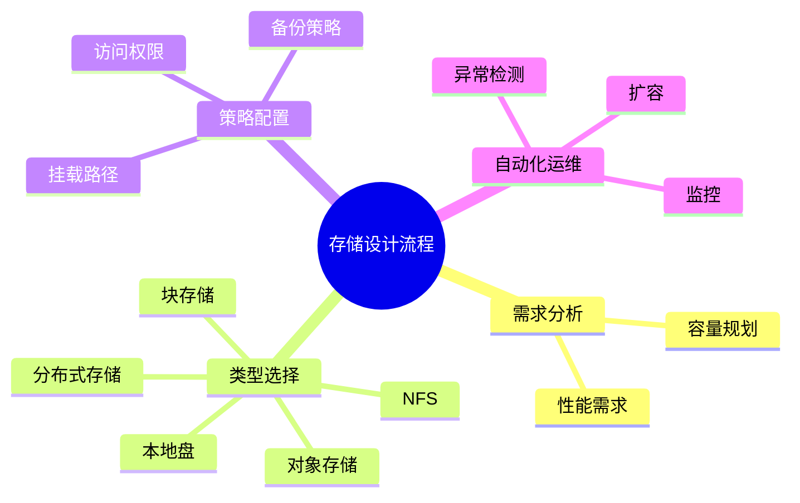

# 存储建模理论探讨

## 目录（Table of Contents）

- [存储建模理论探讨](#存储建模理论探讨)
  - [目录（Table of Contents）](#目录table-of-contents)
  - [1. 形式化目标](#1-形式化目标)
  - [2. 核心概念](#2-核心概念)
  - [3. 已有标准](#3-已有标准)
  - [4. 可行性分析](#4-可行性分析)
  - [5. 自动化价值](#5-自动化价值)
  - [6. 与AI结合点](#6-与ai结合点)
  - [7. 常见存储类型与特性一览（表格）](#7-常见存储类型与特性一览表格)
  - [8. 存储设计流程思维导图](#8-存储设计流程思维导图)
  - [9. 形式化推理/证明片段](#9-形式化推理证明片段)
  - [理论确定性与论证推理](#理论确定性与论证推理)

## 1. 形式化目标

- 以结构化方式描述持久化存储的类型、挂载、容量、访问策略、备份等。
- 支持多种存储（本地、分布式、对象、块等）统一建模。
- 便于自动生成存储配置、挂载脚本、监控与测试用例等。

## 2. 核心概念

- **存储类型**：本地盘、NFS、对象存储、块存储等。
- **挂载与容量**：挂载路径、容量分配、动态扩容。
- **访问策略**：读写权限、共享、隔离。
- **备份与恢复**：快照、定时备份、恢复策略。
- **存储类与QoS**：性能等级、存储类、IOPS限制。

## 3. 已有标准

- Kubernetes PersistentVolume/StorageClass
- Ceph、NFS、S3、GlusterFS等
- CSI（容器存储接口）

## 4. 可行性分析

- 存储建模结构化强，标准化程度高，适合DSL抽象。
- 可自动生成存储配置、挂载脚本、监控等。
- 易于与AI结合进行容量规划、异常检测、自动扩容。

## 5. 自动化价值

- 降低手工配置和维护存储的成本。
- 提高数据安全性、可用性和弹性。
- 支持自动化备份、恢复和扩容。

## 6. 与AI结合点

- 智能补全存储配置、容量规划。
- 自动推理存储瓶颈、异常检测。
- 智能生成备份与恢复建议。

---

## 7. 常见存储类型与特性一览（表格）

| 类型         | 特性                 | 典型场景           |
|--------------|----------------------|--------------------|
| 本地盘       | 低延迟、节点本地     | 日志、缓存         |
| NFS          | 网络共享、易扩展     | 多Pod共享数据      |
| 对象存储     | 高可用、弹性扩展     | 备份、归档、图片   |
| 块存储       | 高性能、可挂载多节点 | 数据库、持久卷     |
| 分布式存储   | 高可用、弹性、冗余   | 云原生存储         |

---

## 8. 存储设计流程思维导图

---

## 9. 形式化推理/证明片段

**定理（数据持久性）**：
若存储卷启用快照与定时备份，则数据可恢复至任意备份点。

*证明思路*：
任意时刻t，存在最近一次快照/备份，恢复操作可回滚至该点。

**推论（容量可扩展性）**：
若存储支持动态扩容，则可根据负载自动调整容量，无需停机。

## 理论确定性与论证推理

在存储建模领域，理论确定性是实现存储自动化配置、数据管理、容量规划的基础。以 Kubernetes CSI、Ceph、NFS、S3、GlusterFS 等主流存储平台为例：

1. **形式化定义**  
   存储类型、挂载策略、容量配置、备份规则等均有标准化描述和配置语言。

2. **公理化系统**  
   通过存储编排和数据管理，实现存储逻辑的自动推理与容量优化。

3. **类型安全**  
   存储配置、挂载路径、访问权限等类型严格定义，防止数据访问错误。

4. **可证明性**  
   关键属性如数据持久性、容量可扩展性等可通过验证和测试进行形式化证明。

这些理论基础为存储建模的自动化配置、数据管理和容量规划提供了理论支撑。
