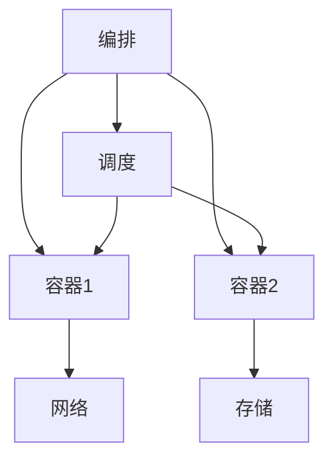

# 运行时模型理论创新与递归推理

## 1. 理论创新与差异化

- **递归运行时AST结构**：支持容器、网络、编排、存储、调度等多层嵌套与组合，表达复杂运行时环境。
- **资源与依赖推理**：引入资源分配、依赖链递归解析、动态调度等机制。
- **AI自动化**：集成AI辅助资源优化、异常检测、自动修复、弹性扩缩容建议。
- **工程难点与创新**：解决多层容器编排、网络隔离、存储一致性、调度冲突等工程难题。

## 2. 递归推理伪代码

```python
# 递归推理：自动推导容器编排的资源依赖与调度顺序

def infer_runtime_plan(node):
    plan = []
    for dep in node.dependencies:
        plan.extend(infer_runtime_plan(dep))
    plan.append(node)
    return plan
```

## 3. 典型递归流程图



## 4. 实际代码片段（AI辅助资源优化）

```python
# AI辅助生成资源分配建议

def ai_optimize_resources(runtime_spec):
    # runtime_spec: 包含容器、网络、存储、调度等定义
    return ai_model.suggest_resource_plan(runtime_spec)

# 递归检测运行时异常

def detect_runtime_issues(node):
    issues = []
    if not node.health_check():
        issues.append(node)
    for dep in node.dependencies:
        issues.extend(detect_runtime_issues(dep))
    return issues
```

## 5. 工程难点与创新解决方案

- **多层容器编排递归解析**：自动发现容器、网络、存储、调度间的依赖与冲突。
- **网络隔离与安全**：支持多级网络策略、递归校验隔离与访问控制。
- **存储一致性与弹性**：递归检测存储一致性、自动扩缩容与备份恢复。
- **AI驱动的运行时优化**：利用AI分析运行轨迹，自动优化资源分配与调度策略。

## 6. 行业映射与案例

- 云原生：多层容器编排与弹性调度，AI辅助资源优化与异常自愈。
- AI基础设施：分布式训练/推理的资源调度与存储一致性，AI自动生成运行时配置。
- 工业：边缘设备容器化、网络隔离与弹性调度，AI辅助异常检测与恢复。

---

> 本文档持续递归完善，欢迎补充更多创新理论、推理伪代码、流程图与行业案例。
