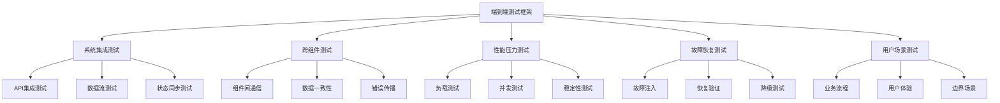

# 端到端集成测试框架 (End-to-End Integration Testing Framework)

## 1. 概述

本文档建立了测试元模型的端到端集成测试框架，包括系统级测试、跨组件集成测试、性能压力测试和故障恢复测试。通过完整的端到端测试验证，确保整个测试系统的稳定性和可靠性。

## 2. 端到端测试架构

### 2.1 测试架构设计



### 2.2 测试层次结构

- **L1 - 单元测试层**：单个组件功能测试
- **L2 - 集成测试层**：组件间交互测试
- **L3 - 系统测试层**：完整系统功能测试
- **L4 - 端到端测试层**：真实用户场景测试

## 3. 系统集成测试

### 3.1 API集成测试框架

```python
class APIIntegrationTest:
    def __init__(self, base_url, test_config):
        self.base_url = base_url
        self.test_config = test_config
        self.test_results = []
        
    def test_api_integration(self):
        """测试API集成"""
        print("开始API集成测试...")
        
        # 测试认证集成
        self.test_authentication_integration()
        
        # 测试数据流集成
        self.test_data_flow_integration()
        
        # 测试状态同步集成
        self.test_state_synchronization()
        
        # 测试错误处理集成
        self.test_error_handling_integration()
        
        print("API集成测试完成")
        return self.test_results
        
    def test_authentication_integration(self):
        """测试认证集成"""
        test_cases = [
            {
                'name': '有效用户认证',
                'username': 'valid_user',
                'password': 'valid_password',
                'expected': 'SUCCESS'
            },
            {
                'name': '无效用户认证',
                'username': 'invalid_user',
                'password': 'invalid_password',
                'expected': 'FAILURE'
            },
            {
                'name': '会话超时处理',
                'username': 'valid_user',
                'password': 'valid_password',
                'expected': 'SESSION_EXPIRED'
            }
        ]
        
        for test_case in test_cases:
            result = self._execute_auth_test(test_case)
            self.test_results.append(result)
            
    def test_data_flow_integration(self):
        """测试数据流集成"""
        # 测试数据创建流程
        self._test_data_creation_flow()
        
        # 测试数据更新流程
        self._test_data_update_flow()
        
        # 测试数据删除流程
        self._test_data_deletion_flow()
        
    def test_state_synchronization(self):
        """测试状态同步集成"""
        # 测试多用户状态同步
        self._test_multi_user_state_sync()
        
        # 测试分布式状态一致性
        self._test_distributed_state_consistency()
        
    def test_error_handling_integration(self):
        """测试错误处理集成"""
        # 测试网络错误处理
        self._test_network_error_handling()
        
        # 测试数据错误处理
        self._test_data_error_handling()
        
        # 测试系统错误处理
        self._test_system_error_handling()
```

### 3.2 数据流集成测试

```python
class DataFlowIntegrationTest:
    def __init__(self, test_system):
        self.test_system = test_system
        self.data_flow_results = []
        
    def test_complete_data_flow(self):
        """测试完整数据流"""
        print("开始数据流集成测试...")
        
        # 测试数据输入流
        input_flow_result = self._test_data_input_flow()
        self.data_flow_results.append(input_flow_result)
        
        # 测试数据处理流
        process_flow_result = self._test_data_processing_flow()
        self.data_flow_results.append(process_flow_result)
        
        # 测试数据输出流
        output_flow_result = self._test_data_output_flow()
        self.data_flow_results.append(output_flow_result)
        
        # 测试数据一致性
        consistency_result = self._test_data_consistency()
        self.data_flow_results.append(consistency_result)
        
        print("数据流集成测试完成")
        return self.data_flow_results
        
    def _test_data_input_flow(self):
        """测试数据输入流"""
        test_data = {
            'test_case': 'data_input_flow',
            'input_sources': ['file_upload', 'api_call', 'database'],
            'validation_rules': ['format_check', 'content_check', 'size_check']
        }
        
        # 执行输入流测试
        input_results = []
        for source in test_data['input_sources']:
            for rule in test_data['validation_rules']:
                result = self._execute_input_test(source, rule)
                input_results.append(result)
                
        return {
            'test_type': 'data_input_flow',
            'results': input_results,
            'status': 'COMPLETED'
        }
        
    def _test_data_processing_flow(self):
        """测试数据处理流"""
        processing_steps = [
            'data_validation',
            'data_transformation',
            'data_enrichment',
            'data_aggregation'
        ]
        
        processing_results = []
        for step in processing_steps:
            result = self._execute_processing_test(step)
            processing_results.append(result)
            
        return {
            'test_type': 'data_processing_flow',
            'results': processing_results,
            'status': 'COMPLETED'
        }
        
    def _test_data_output_flow(self):
        """测试数据输出流"""
        output_targets = [
            'database_storage',
            'file_export',
            'api_response',
            'notification_system'
        ]
        
        output_results = []
        for target in output_targets:
            result = self._execute_output_test(target)
            output_results.append(result)
            
        return {
            'test_type': 'data_output_flow',
            'results': output_results,
            'status': 'COMPLETED'
        }
```

## 4. 跨组件集成测试

### 4.1 组件间通信测试

```python
class ComponentCommunicationTest:
    def __init__(self, component_registry):
        self.component_registry = component_registry
        self.communication_results = []
        
    def test_component_communication(self):
        """测试组件间通信"""
        print("开始组件间通信测试...")
        
        # 测试同步通信
        sync_results = self._test_synchronous_communication()
        self.communication_results.append(sync_results)
        
        # 测试异步通信
        async_results = self._test_asynchronous_communication()
        self.communication_results.append(async_results)
        
        # 测试事件驱动通信
        event_results = self._test_event_driven_communication()
        self.communication_results.append(event_results)
        
        # 测试消息队列通信
        queue_results = self._test_message_queue_communication()
        self.communication_results.append(queue_results)
        
        print("组件间通信测试完成")
        return self.communication_results
        
    def _test_synchronous_communication(self):
        """测试同步通信"""
        sync_tests = [
            {
                'name': '直接方法调用',
                'type': 'direct_method_call',
                'components': ['ComponentA', 'ComponentB']
            },
            {
                'name': 'RPC调用',
                'type': 'rpc_call',
                'components': ['ServiceA', 'ServiceB']
            },
            {
                'name': 'HTTP调用',
                'type': 'http_call',
                'components': ['WebServiceA', 'WebServiceB']
            }
        ]
        
        results = []
        for test in sync_tests:
            result = self._execute_sync_test(test)
            results.append(result)
            
        return {
            'test_type': 'synchronous_communication',
            'results': results,
            'status': 'COMPLETED'
        }
        
    def _test_asynchronous_communication(self):
        """测试异步通信"""
        async_tests = [
            {
                'name': '回调机制',
                'type': 'callback_mechanism',
                'components': ['AsyncComponentA', 'AsyncComponentB']
            },
            {
                'name': 'Promise模式',
                'type': 'promise_pattern',
                'components': ['PromiseComponentA', 'PromiseComponentB']
            },
            {
                'name': 'Future模式',
                'type': 'future_pattern',
                'components': ['FutureComponentA', 'FutureComponentB']
            }
        ]
        
        results = []
        for test in async_tests:
            result = self._execute_async_test(test)
            results.append(result)
            
        return {
            'test_type': 'asynchronous_communication',
            'results': results,
            'status': 'COMPLETED'
        }
```

### 4.2 数据一致性测试

```python
class DataConsistencyTest:
    def __init__(self, data_sources):
        self.data_sources = data_sources
        self.consistency_results = []
        
    def test_data_consistency(self):
        """测试数据一致性"""
        print("开始数据一致性测试...")
        
        # 测试ACID属性
        acid_results = self._test_acid_properties()
        self.consistency_results.append(acid_results)
        
        # 测试分布式一致性
        distributed_results = self._test_distributed_consistency()
        self.consistency_results.append(distributed_results)
        
        # 测试最终一致性
        eventual_results = self._test_eventual_consistency()
        self.consistency_results.append(eventual_results)
        
        # 测试因果一致性
        causal_results = self._test_causal_consistency()
        self.consistency_results.append(causal_results)
        
        print("数据一致性测试完成")
        return self.consistency_results
        
    def _test_acid_properties(self):
        """测试ACID属性"""
        acid_tests = [
            {
                'name': '原子性测试',
                'property': 'atomicity',
                'scenario': 'transaction_rollback'
            },
            {
                'name': '一致性测试',
                'property': 'consistency',
                'scenario': 'constraint_violation'
            },
            {
                'name': '隔离性测试',
                'property': 'isolation',
                'scenario': 'concurrent_access'
            },
            {
                'name': '持久性测试',
                'property': 'durability',
                'scenario': 'system_crash'
            }
        ]
        
        results = []
        for test in acid_tests:
            result = self._execute_acid_test(test)
            results.append(result)
            
        return {
            'test_type': 'acid_properties',
            'results': results,
            'status': 'COMPLETED'
        }
        
    def _test_distributed_consistency(self):
        """测试分布式一致性"""
        # 测试CAP定理
        cap_results = self._test_cap_theorem()
        
        # 测试Paxos算法
        paxos_results = self._test_paxos_algorithm()
        
        # 测试Raft算法
        raft_results = self._test_raft_algorithm()
        
        return {
            'test_type': 'distributed_consistency',
            'cap_results': cap_results,
            'paxos_results': paxos_results,
            'raft_results': raft_results,
            'status': 'COMPLETED'
        }
```

## 5. 性能压力测试

### 5.1 负载测试框架

```python
class LoadTestFramework:
    def __init__(self, target_system, load_config):
        self.target_system = target_system
        self.load_config = load_config
        self.load_test_results = []
        
    def run_load_tests(self):
        """运行负载测试"""
        print("开始负载测试...")
        
        # 基础负载测试
        basic_load_results = self._run_basic_load_test()
        self.load_test_results.append(basic_load_results)
        
        # 峰值负载测试
        peak_load_results = self._run_peak_load_test()
        self.load_test_results.append(peak_load_results)
        
        # 持续负载测试
        sustained_load_results = self._run_sustained_load_test()
        self.load_test_results.append(sustained_load_results)
        
        # 阶梯负载测试
        step_load_results = self._run_step_load_test()
        self.load_test_results.append(step_load_results)
        
        print("负载测试完成")
        return self.load_test_results
        
    def _run_basic_load_test(self):
        """运行基础负载测试"""
        load_levels = [100, 500, 1000, 2000]
        test_duration = 300  # 5分钟
        
        results = []
        for load in load_levels:
            print(f"测试负载 {load} 请求/秒...")
            
            # 配置负载生成器
            self._configure_load_generator(load)
            
            # 运行测试
            test_result = self._execute_load_test(test_duration)
            test_result['load_level'] = load
            
            results.append(test_result)
            
        return {
            'test_type': 'basic_load_test',
            'results': results,
            'status': 'COMPLETED'
        }
        
    def _run_peak_load_test(self):
        """运行峰值负载测试"""
        peak_load = self.load_config.get('peak_load', 5000)
        test_duration = 600  # 10分钟
        
        print(f"测试峰值负载 {peak_load} 请求/秒...")
        
        # 配置峰值负载
        self._configure_load_generator(peak_load)
        
        # 运行峰值测试
        peak_result = self._execute_load_test(test_duration)
        
        return {
            'test_type': 'peak_load_test',
            'peak_load': peak_load,
            'result': peak_result,
            'status': 'COMPLETED'
        }
        
    def _run_sustained_load_test(self):
        """运行持续负载测试"""
        sustained_load = self.load_config.get('sustained_load', 2000)
        test_duration = 3600  # 1小时
        
        print(f"测试持续负载 {sustained_load} 请求/秒...")
        
        # 配置持续负载
        self._configure_load_generator(sustained_load)
        
        # 运行持续测试
        sustained_result = self._execute_load_test(test_duration)
        
        return {
            'test_type': 'sustained_load_test',
            'sustained_load': sustained_load,
            'result': sustained_result,
            'status': 'COMPLETED'
        }
        
    def _run_step_load_test(self):
        """运行阶梯负载测试"""
        step_config = self.load_config.get('step_load', {
            'start_load': 100,
            'end_load': 5000,
            'step_size': 500,
            'step_duration': 300
        })
        
        print("运行阶梯负载测试...")
        
        current_load = step_config['start_load']
        step_results = []
        
        while current_load <= step_config['end_load']:
            print(f"当前负载: {current_load} 请求/秒")
            
            # 配置当前负载
            self._configure_load_generator(current_load)
            
            # 运行当前步骤测试
            step_result = self._execute_load_test(step_config['step_duration'])
            step_result['load_level'] = current_load
            
            step_results.append(step_result)
            
            # 检查系统状态
            if not self._is_system_healthy():
                print(f"系统在负载 {current_load} 时出现异常")
                break
                
            current_load += step_config['step_size']
            
        return {
            'test_type': 'step_load_test',
            'results': step_results,
            'max_sustained_load': current_load - step_config['step_size'],
            'status': 'COMPLETED'
        }
```

### 5.2 并发测试框架

```python
class ConcurrencyTestFramework:
    def __init__(self, target_system, concurrency_config):
        self.target_system = target_system
        self.concurrency_config = concurrency_config
        self.concurrency_results = []
        
    def run_concurrency_tests(self):
        """运行并发测试"""
        print("开始并发测试...")
        
        # 线程安全测试
        thread_safety_results = self._test_thread_safety()
        self.concurrency_results.append(thread_safety_results)
        
        # 死锁检测测试
        deadlock_results = self._test_deadlock_detection()
        self.concurrency_results.append(deadlock_results)
        
        # 竞态条件测试
        race_condition_results = self._test_race_conditions()
        self.concurrency_results.append(race_condition_results)
        
        # 资源竞争测试
        resource_contention_results = self._test_resource_contention()
        self.concurrency_results.append(resource_contention_results)
        
        print("并发测试完成")
        return self.concurrency_results
        
    def _test_thread_safety(self):
        """测试线程安全"""
        thread_counts = [2, 4, 8, 16, 32]
        test_duration = 60  # 1分钟
        
        results = []
        for thread_count in thread_counts:
            print(f"测试 {thread_count} 个线程的线程安全...")
            
            # 创建测试线程
            test_threads = self._create_test_threads(thread_count)
            
            # 启动所有线程
            start_time = time.time()
            for thread in test_threads:
                thread.start()
                
            # 等待所有线程完成
            for thread in test_threads:
                thread.join()
                
            end_time = time.time()
            
            # 验证结果一致性
            consistency_check = self._verify_result_consistency()
            
            result = {
                'thread_count': thread_count,
                'execution_time': end_time - start_time,
                'result_consistency': consistency_check,
                'status': 'COMPLETED'
            }
            
            results.append(result)
            
        return {
            'test_type': 'thread_safety',
            'results': results,
            'status': 'COMPLETED'
        }
        
    def _test_deadlock_detection(self):
        """测试死锁检测"""
        deadlock_scenarios = [
            {
                'name': '经典死锁场景',
                'description': '两个线程互相等待对方释放资源',
                'expected': 'DEADLOCK_DETECTED'
            },
            {
                'name': '循环等待场景',
                'description': '多个线程形成循环等待链',
                'expected': 'DEADLOCK_DETECTED'
            },
            {
                'name': '资源分配场景',
                'description': '资源分配不当导致的死锁',
                'expected': 'DEADLOCK_DETECTED'
            }
        ]
        
        results = []
        for scenario in deadlock_scenarios:
            print(f"测试死锁场景: {scenario['name']}")
            
            # 执行死锁场景
            scenario_result = self._execute_deadlock_scenario(scenario)
            scenario_result['scenario'] = scenario['name']
            
            results.append(scenario_result)
            
        return {
            'test_type': 'deadlock_detection',
            'results': results,
            'status': 'COMPLETED'
        }
```

## 6. 故障恢复测试

### 6.1 故障注入测试

```python
class FaultInjectionTest:
    def __init__(self, target_system, fault_config):
        self.target_system = target_system
        self.fault_config = fault_config
        self.fault_test_results = []
        
    def run_fault_injection_tests(self):
        """运行故障注入测试"""
        print("开始故障注入测试...")
        
        # 网络故障注入
        network_fault_results = self._inject_network_faults()
        self.fault_test_results.append(network_fault_results)
        
        # 硬件故障注入
        hardware_fault_results = self._inject_hardware_faults()
        self.fault_test_results.append(hardware_fault_results)
        
        # 软件故障注入
        software_fault_results = self._inject_software_faults()
        self.fault_test_results.append(software_fault_results)
        
        # 数据故障注入
        data_fault_results = self._inject_data_faults()
        self.fault_test_results.append(data_fault_results)
        
        print("故障注入测试完成")
        return self.fault_test_results
        
    def _inject_network_faults(self):
        """注入网络故障"""
        network_faults = [
            {
                'name': '网络延迟',
                'type': 'latency',
                'parameters': {'delay_ms': 1000}
            },
            {
                'name': '网络丢包',
                'type': 'packet_loss',
                'parameters': {'loss_rate': 0.1}
            },
            {
                'name': '网络中断',
                'type': 'disconnection',
                'parameters': {'duration_seconds': 30}
            },
            {
                'name': '网络拥塞',
                'type': 'congestion',
                'parameters': {'bandwidth_limit': '1Mbps'}
            }
        ]
        
        results = []
        for fault in network_faults:
            print(f"注入网络故障: {fault['name']}")
            
            # 注入故障
            fault_result = self._inject_network_fault(fault)
            fault_result['fault_type'] = fault['name']
            
            results.append(fault_result)
            
        return {
            'test_type': 'network_fault_injection',
            'results': results,
            'status': 'COMPLETED'
        }
        
    def _inject_hardware_faults(self):
        """注入硬件故障"""
        hardware_faults = [
            {
                'name': 'CPU过载',
                'type': 'cpu_overload',
                'parameters': {'load_percentage': 100}
            },
            {
                'name': '内存不足',
                'type': 'memory_shortage',
                'parameters': {'available_mb': 100}
            },
            {
                'name': '磁盘空间不足',
                'type': 'disk_space_shortage',
                'parameters': {'available_gb': 1}
            },
            {
                'name': '磁盘I/O故障',
                'type': 'disk_io_failure',
                'parameters': {'error_rate': 0.5}
            }
        ]
        
        results = []
        for fault in hardware_faults:
            print(f"注入硬件故障: {fault['name']}")
            
            # 注入故障
            fault_result = self._inject_hardware_fault(fault)
            fault_result['fault_type'] = fault['name']
            
            results.append(fault_result)
            
        return {
            'test_type': 'hardware_fault_injection',
            'results': results,
            'status': 'COMPLETED'
        }
```

### 6.2 故障恢复验证

```python
class FaultRecoveryVerification:
    def __init__(self, target_system):
        self.target_system = target_system
        self.recovery_results = []
        
    def verify_fault_recovery(self):
        """验证故障恢复"""
        print("开始故障恢复验证...")
        
        # 验证自动恢复
        auto_recovery_results = self._verify_auto_recovery()
        self.recovery_results.append(auto_recovery_results)
        
        # 验证手动恢复
        manual_recovery_results = self._verify_manual_recovery()
        self.recovery_results.append(manual_recovery_results)
        
        # 验证降级服务
        degradation_results = self._verify_service_degradation()
        self.recovery_results.append(degradation_results)
        
        # 验证数据恢复
        data_recovery_results = self._verify_data_recovery()
        self.recovery_results.append(data_recovery_results)
        
        print("故障恢复验证完成")
        return self.recovery_results
        
    def _verify_auto_recovery(self):
        """验证自动恢复"""
        recovery_scenarios = [
            {
                'name': '服务重启恢复',
                'fault_type': 'service_crash',
                'expected_recovery_time': 30
            },
            {
                'name': '连接重连恢复',
                'fault_type': 'connection_loss',
                'expected_recovery_time': 10
            },
            {
                'name': '资源释放恢复',
                'fault_type': 'resource_exhaustion',
                'expected_recovery_time': 60
            }
        ]
        
        results = []
        for scenario in recovery_scenarios:
            print(f"验证自动恢复场景: {scenario['name']}")
            
            # 执行恢复验证
            recovery_result = self._execute_recovery_verification(scenario)
            recovery_result['scenario'] = scenario['name']
            
            results.append(recovery_result)
            
        return {
            'test_type': 'auto_recovery_verification',
            'results': results,
            'status': 'COMPLETED'
        }
        
    def _verify_service_degradation(self):
        """验证服务降级"""
        degradation_scenarios = [
            {
                'name': '功能降级',
                'fault_type': 'partial_failure',
                'expected_behavior': 'degraded_functionality'
            },
            {
                'name': '性能降级',
                'fault_type': 'performance_degradation',
                'expected_behavior': 'reduced_performance'
            },
            {
                'name': '可用性降级',
                'fault_type': 'availability_reduction',
                'expected_behavior': 'limited_availability'
            }
        ]
        
        results = []
        for scenario in degradation_scenarios:
            print(f"验证服务降级场景: {scenario['name']}")
            
            # 执行降级验证
            degradation_result = self._execute_degradation_verification(scenario)
            degradation_result['scenario'] = scenario['name']
            
            results.append(degradation_result)
            
        return {
            'test_type': 'service_degradation_verification',
            'results': results,
            'status': 'COMPLETED'
        }
```

## 7. 用户场景测试

### 7.1 业务流程测试

```python
class BusinessProcessTest:
    def __init__(self, test_system, business_scenarios):
        self.test_system = test_system
        self.business_scenarios = business_scenarios
        self.business_test_results = []
        
    def test_business_processes(self):
        """测试业务流程"""
        print("开始业务流程测试...")
        
        for scenario in self.business_scenarios:
            print(f"测试业务流程: {scenario['name']}")
            
            # 执行业务流程测试
            scenario_result = self._execute_business_scenario(scenario)
            self.business_test_results.append(scenario_result)
            
        print("业务流程测试完成")
        return self.business_test_results
        
    def _execute_business_scenario(self, scenario):
        """执行业务场景测试"""
        # 准备测试数据
        test_data = self._prepare_test_data(scenario)
        
        # 执行业务流程步骤
        step_results = []
        for step in scenario['steps']:
            step_result = self._execute_business_step(step, test_data)
            step_results.append(step_result)
            
            # 检查步骤是否成功
            if not step_result['success']:
                print(f"业务步骤失败: {step['name']}")
                break
                
        # 验证最终结果
        final_validation = self._validate_business_result(scenario, test_data)
        
        return {
            'scenario_name': scenario['name'],
            'step_results': step_results,
            'final_validation': final_validation,
            'overall_success': all(step['success'] for step in step_results),
            'status': 'COMPLETED'
        }
```

### 7.2 用户体验测试

```python
class UserExperienceTest:
    def __init__(self, test_system, ux_scenarios):
        self.test_system = test_system
        self.ux_scenarios = ux_scenarios
        self.ux_test_results = []
        
    def test_user_experience(self):
        """测试用户体验"""
        print("开始用户体验测试...")
        
        # 测试响应时间
        response_time_results = self._test_response_times()
        self.ux_test_results.append(response_time_results)
        
        # 测试界面可用性
        usability_results = self._test_interface_usability()
        self.ux_test_results.append(usability_results)
        
        # 测试操作流程
        workflow_results = self._test_user_workflows()
        self.ux_test_results.append(workflow_results)
        
        # 测试错误处理
        error_handling_results = self._test_error_handling()
        self.ux_test_results.append(error_handling_results)
        
        print("用户体验测试完成")
        return self.ux_test_results
        
    def _test_response_times(self):
        """测试响应时间"""
        response_time_scenarios = [
            {
                'name': '页面加载时间',
                'metric': 'page_load_time',
                'threshold': 2000  # 2秒
            },
            {
                'name': '操作响应时间',
                'metric': 'operation_response_time',
                'threshold': 500   # 500毫秒
            },
            {
                'name': '搜索响应时间',
                'metric': 'search_response_time',
                'threshold': 1000  # 1秒
            }
        ]
        
        results = []
        for scenario in response_time_scenarios:
            print(f"测试响应时间: {scenario['name']}")
            
            # 执行响应时间测试
            response_result = self._execute_response_time_test(scenario)
            response_result['scenario'] = scenario['name']
            
            results.append(response_result)
            
        return {
            'test_type': 'response_time_test',
            'results': results,
            'status': 'COMPLETED'
        }
```

## 8. 测试报告生成

### 8.1 综合测试报告

```python
class ComprehensiveTestReport:
    def __init__(self, all_test_results):
        self.all_test_results = all_test_results
        self.report_data = {}
        
    def generate_comprehensive_report(self):
        """生成综合测试报告"""
        print("生成综合测试报告...")
        
        # 汇总所有测试结果
        self._aggregate_test_results()
        
        # 生成执行摘要
        self._generate_execution_summary()
        
        # 生成性能分析
        self._generate_performance_analysis()
        
        # 生成质量评估
        self._generate_quality_assessment()
        
        # 生成改进建议
        self._generate_improvement_recommendations()
        
        print("综合测试报告生成完成")
        return self.report_data
        
    def _aggregate_test_results(self):
        """汇总测试结果"""
        total_tests = 0
        passed_tests = 0
        failed_tests = 0
        
        for test_category in self.all_test_results:
            for test_result in test_category:
                total_tests += 1
                if test_result.get('overall_success', False):
                    passed_tests += 1
                else:
                    failed_tests += 1
                    
        self.report_data['test_summary'] = {
            'total_tests': total_tests,
            'passed_tests': passed_tests,
            'failed_tests': failed_tests,
            'success_rate': (passed_tests / total_tests * 100) if total_tests > 0 else 0
        }
        
    def _generate_execution_summary(self):
        """生成执行摘要"""
        execution_summary = {
            'test_categories': len(self.all_test_results),
            'total_execution_time': 0,
            'average_execution_time': 0,
            'longest_test': None,
            'shortest_test': None
        }
        
        # 计算执行时间统计
        execution_times = []
        for test_category in self.all_test_results:
            for test_result in test_category:
                if 'execution_time' in test_result:
                    execution_times.append(test_result['execution_time'])
                    
        if execution_times:
            execution_summary['total_execution_time'] = sum(execution_times)
            execution_summary['average_execution_time'] = sum(execution_times) / len(execution_times)
            execution_summary['longest_test'] = max(execution_times)
            execution_summary['shortest_test'] = min(execution_times)
            
        self.report_data['execution_summary'] = execution_summary
        
    def _generate_performance_analysis(self):
        """生成性能分析"""
        performance_metrics = {
            'response_times': [],
            'throughput_rates': [],
            'resource_utilization': [],
            'error_rates': []
        }
        
        # 收集性能指标
        for test_category in self.all_test_results:
            for test_result in test_category:
                if 'performance_metrics' in test_result:
                    metrics = test_result['performance_metrics']
                    for key in performance_metrics:
                        if key in metrics:
                            performance_metrics[key].extend(metrics[key])
                            
        # 计算性能统计
        performance_analysis = {}
        for metric_name, values in performance_metrics.items():
            if values:
                performance_analysis[metric_name] = {
                    'count': len(values),
                    'average': sum(values) / len(values),
                    'minimum': min(values),
                    'maximum': max(values),
                    'median': sorted(values)[len(values)//2]
                }
                
        self.report_data['performance_analysis'] = performance_analysis
        
    def _generate_quality_assessment(self):
        """生成质量评估"""
        quality_metrics = {
            'functionality': 0,
            'reliability': 0,
            'performance': 0,
            'security': 0,
            'usability': 0
        }
        
        # 计算各质量维度的得分
        for test_category in self.all_test_results:
            for test_result in test_category:
                if 'quality_metrics' in test_result:
                    metrics = test_result['quality_metrics']
                    for dimension in quality_metrics:
                        if dimension in metrics:
                            quality_metrics[dimension] += metrics[dimension]
                            
        # 计算平均分
        for dimension in quality_metrics:
            quality_metrics[dimension] = quality_metrics[dimension] / len(self.all_test_results)
            
        self.report_data['quality_assessment'] = quality_metrics
        
    def _generate_improvement_recommendations(self):
        """生成改进建议"""
        recommendations = []
        
        # 基于测试结果生成建议
        if self.report_data['test_summary']['success_rate'] < 90:
            recommendations.append({
                'category': 'test_quality',
                'priority': 'HIGH',
                'description': '测试成功率低于90%，需要改进测试用例和测试环境',
                'action_items': [
                    '审查失败的测试用例',
                    '检查测试环境配置',
                    '改进测试数据准备'
                ]
            })
            
        # 基于性能分析生成建议
        if 'performance_analysis' in self.report_data:
            perf_analysis = self.report_data['performance_analysis']
            if 'response_times' in perf_analysis:
                avg_response_time = perf_analysis['response_times']['average']
                if avg_response_time > 1000:  # 1秒
                    recommendations.append({
                        'category': 'performance',
                        'priority': 'MEDIUM',
                        'description': f'平均响应时间({avg_response_time}ms)超过1秒，需要性能优化',
                        'action_items': [
                            '优化数据库查询',
                            '改进缓存策略',
                            '增加服务器资源'
                        ]
                    })
                    
        self.report_data['improvement_recommendations'] = recommendations
```

## 9. 总结

本文档建立了完整的端到端集成测试框架，包括：

1. **系统集成测试**：API集成、数据流集成、状态同步集成
2. **跨组件测试**：组件间通信、数据一致性、错误传播
3. **性能压力测试**：负载测试、并发测试、稳定性测试
4. **故障恢复测试**：故障注入、恢复验证、降级测试
5. **用户场景测试**：业务流程、用户体验、边界场景
6. **综合测试报告**：执行摘要、性能分析、质量评估、改进建议

通过这个端到端集成测试框架，我们能够：

- 验证整个系统的集成稳定性
- 确保跨组件协作的正确性
- 验证系统在压力下的表现
- 测试故障恢复和容错能力
- 验证真实用户场景的可用性
- 提供全面的测试质量评估

这个框架为测试元模型提供了完整的系统级验证能力，确保了整个测试系统的高质量和高可靠性。
