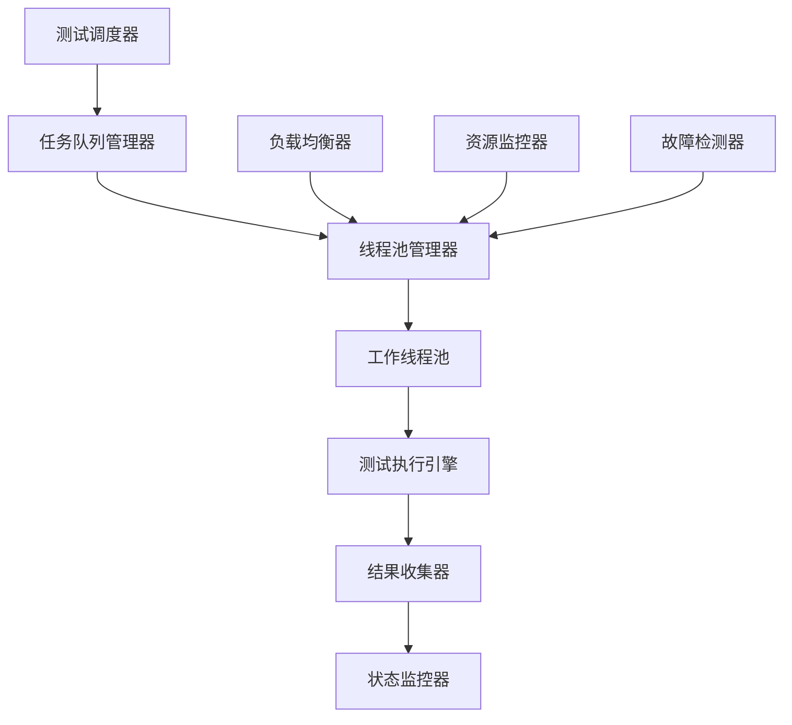

# 多线程测试架构优化 (Multi-threaded Testing Architecture Optimization)

## 1. 概述

本文档描述了测试元模型的多线程架构优化方案，包括任务调度算法、线程池管理、负载均衡策略和性能优化机制。通过多线程并行处理，显著提升测试执行效率和系统吞吐量。

## 2. 架构设计原则

### 2.1 设计目标

- **高并发性**：支持大量测试用例并行执行
- **高可用性**：确保系统稳定性和故障恢复能力
- **高扩展性**：支持动态扩展和收缩
- **高效率性**：最大化资源利用率和执行效率

### 2.2 设计原则

- **单一职责原则**：每个线程专注于特定任务类型
- **开闭原则**：支持扩展新的测试类型和策略
- **依赖倒置原则**：高层模块不依赖低层模块
- **接口隔离原则**：客户端只依赖需要的接口

## 3. 多线程架构组件

### 3.1 核心组件架构



### 3.2 组件职责

#### 测试调度器 (Test Scheduler)

- 接收测试请求
- 分析测试依赖关系
- 生成执行计划
- 分配执行优先级

#### 任务队列管理器 (Task Queue Manager)

- 管理待执行任务队列
- 实现优先级队列
- 处理任务依赖关系
- 任务状态跟踪

#### 线程池管理器 (Thread Pool Manager)

- 创建和管理工作线程
- 动态调整线程数量
- 线程生命周期管理
- 线程状态监控

#### 工作线程池 (Worker Thread Pool)

- 执行具体的测试任务
- 处理测试结果
- 异常处理和恢复
- 资源清理

## 4. 任务调度算法

### 4.1 优先级调度算法

```python
class PriorityScheduler:
    def __init__(self):
        self.high_priority_queue = PriorityQueue()
        self.normal_priority_queue = PriorityQueue()
        self.low_priority_queue = PriorityQueue()
        
    def schedule_task(self, task):
        """根据优先级调度任务"""
        if task.priority == Priority.HIGH:
            self.high_priority_queue.put(task)
        elif task.priority == Priority.NORMAL:
            self.normal_priority_queue.put(task)
        else:
            self.low_priority_queue.put(task)
            
    def get_next_task(self):
        """获取下一个要执行的任务"""
        # 高优先级任务优先
        if not self.high_priority_queue.empty():
            return self.high_priority_queue.get()
        elif not self.normal_priority_queue.empty():
            return self.normal_priority_queue.get()
        else:
            return self.low_priority_queue.get()
```

### 4.2 依赖感知调度算法

```python
class DependencyAwareScheduler:
    def __init__(self):
        self.dependency_graph = nx.DiGraph()
        self.ready_tasks = set()
        self.running_tasks = set()
        self.completed_tasks = set()
        
    def add_task(self, task):
        """添加任务到依赖图"""
        self.dependency_graph.add_node(task.id, task=task)
        
        # 添加依赖边
        for dep_id in task.dependencies:
            self.dependency_graph.add_edge(dep_id, task.id)
            
        # 检查是否就绪
        if self.is_task_ready(task):
            self.ready_tasks.add(task.id)
            
    def is_task_ready(self, task):
        """检查任务是否就绪执行"""
        for dep_id in task.dependencies:
            if dep_id not in self.completed_tasks:
                return False
        return True
        
    def get_ready_tasks(self):
        """获取所有就绪的任务"""
        return [self.dependency_graph.nodes[tid]['task'] 
                for tid in self.ready_tasks]
```

### 4.3 负载均衡调度算法

```python
class LoadBalancedScheduler:
    def __init__(self, thread_pools):
        self.thread_pools = thread_pools
        self.task_distribution = {}
        
    def distribute_task(self, task):
        """根据负载均衡策略分配任务"""
        # 选择负载最轻的线程池
        selected_pool = min(self.thread_pools, 
                           key=lambda p: p.get_current_load())
        
        # 分配任务
        selected_pool.submit_task(task)
        self.task_distribution[task.id] = selected_pool.id
        
    def rebalance_if_needed(self):
        """检查是否需要重新平衡负载"""
        loads = [pool.get_current_load() for pool in self.thread_pools]
        max_load = max(loads)
        min_load = min(loads)
        
        # 如果负载差异超过阈值，进行重新平衡
        if max_load - min_load > self.rebalance_threshold:
            self.perform_rebalancing()
```

## 5. 线程池管理

### 5.1 动态线程池

```python
class DynamicThreadPool:
    def __init__(self, min_size=5, max_size=50, keep_alive_time=60):
        self.min_size = min_size
        self.max_size = max_size
        self.keep_alive_time = keep_alive_time
        self.workers = []
        self.task_queue = Queue()
        self.shutdown = False
        
    def start(self):
        """启动线程池"""
        # 创建最小数量的工作线程
        for _ in range(self.min_size):
            self.create_worker()
            
    def create_worker(self):
        """创建新的工作线程"""
        if len(self.workers) < self.max_size:
            worker = WorkerThread(self.task_queue, self)
            worker.start()
            self.workers.append(worker)
            
    def submit_task(self, task):
        """提交任务到线程池"""
        if self.shutdown:
            raise RuntimeError("ThreadPool is shutdown")
            
        # 如果队列过长，考虑创建新线程
        if (self.task_queue.qsize() > len(self.workers) * 2 and 
            len(self.workers) < self.max_size):
            self.create_worker()
            
        self.task_queue.put(task)
        
    def shutdown_pool(self):
        """关闭线程池"""
        self.shutdown = True
        
        # 等待所有工作线程完成
        for worker in self.workers:
            worker.join()
```

### 5.2 工作线程实现

```python
class WorkerThread(Thread):
    def __init__(self, task_queue, pool):
        super().__init__()
        self.task_queue = task_queue
        self.pool = pool
        self.daemon = True
        
    def run(self):
        """工作线程主循环"""
        while not self.pool.shutdown:
            try:
                # 获取任务，设置超时
                task = self.task_queue.get(timeout=1)
                
                # 执行任务
                self.execute_task(task)
                
                # 标记任务完成
                self.task_queue.task_done()
                
            except Empty:
                # 队列为空，继续等待
                continue
            except Exception as e:
                # 处理异常
                self.handle_task_error(task, e)
                
    def execute_task(self, task):
        """执行测试任务"""
        try:
            # 设置任务状态为执行中
            task.status = TaskStatus.RUNNING
            task.start_time = time.time()
            
            # 执行测试
            result = task.execute()
            
            # 设置任务状态为完成
            task.status = TaskStatus.COMPLETED
            task.end_time = time.time()
            task.result = result
            
        except Exception as e:
            # 设置任务状态为失败
            task.status = TaskStatus.FAILED
            task.error = str(e)
            raise
```

## 6. 负载均衡策略

### 6.1 轮询负载均衡

```python
class RoundRobinLoadBalancer:
    def __init__(self, thread_pools):
        self.thread_pools = thread_pools
        self.current_index = 0
        
    def get_next_pool(self):
        """轮询选择下一个线程池"""
        pool = self.thread_pools[self.current_index]
        self.current_index = (self.current_index + 1) % len(self.thread_pools)
        return pool
```

### 6.2 最少连接负载均衡

```python
class LeastConnectionLoadBalancer:
    def __init__(self, thread_pools):
        self.thread_pools = thread_pools
        
    def get_next_pool(self):
        """选择连接数最少的线程池"""
        return min(self.thread_pools, 
                   key=lambda p: p.get_active_connection_count())
```

### 6.3 加权负载均衡

```python
class WeightedLoadBalancer:
    def __init__(self, thread_pools, weights):
        self.thread_pools = thread_pools
        self.weights = weights
        self.current_weights = weights.copy()
        
    def get_next_pool(self):
        """根据权重选择线程池"""
        # 选择权重最高的线程池
        selected_index = self.current_weights.index(max(self.current_weights))
        selected_pool = self.thread_pools[selected_index]
        
        # 减少选中线程池的权重
        self.current_weights[selected_index] -= 1
        
        # 如果权重降到0，重置为原始权重
        if self.current_weights[selected_index] <= 0:
            self.current_weights[selected_index] = self.weights[selected_index]
            
        return selected_pool
```

## 7. 性能监控与优化

### 7.1 性能指标监控

```python
class PerformanceMonitor:
    def __init__(self):
        self.metrics = {
            'task_execution_time': [],
            'thread_utilization': [],
            'queue_length': [],
            'throughput': [],
            'error_rate': []
        }
        
    def record_metric(self, metric_name, value):
        """记录性能指标"""
        if metric_name in self.metrics:
            self.metrics[metric_name].append({
                'timestamp': time.time(),
                'value': value
            })
            
    def get_average_metric(self, metric_name, window_size=100):
        """获取平均性能指标"""
        if metric_name in self.metrics:
            recent_values = self.metrics[metric_name][-window_size:]
            if recent_values:
                return sum(v['value'] for v in recent_values) / len(recent_values)
        return 0
```

### 7.2 自适应优化

```python
class AdaptiveOptimizer:
    def __init__(self, thread_pool, performance_monitor):
        self.thread_pool = thread_pool
        self.performance_monitor = performance_monitor
        self.optimization_interval = 60  # 60秒优化一次
        
    def optimize_thread_pool(self):
        """根据性能指标优化线程池"""
        # 获取当前性能指标
        avg_execution_time = self.performance_monitor.get_average_metric('task_execution_time')
        avg_utilization = self.performance_monitor.get_average_metric('thread_utilization')
        avg_queue_length = self.performance_monitor.get_average_metric('queue_length')
        
        # 根据指标调整线程池大小
        if avg_queue_length > 10 and avg_utilization > 0.8:
            # 队列过长且利用率高，增加线程
            self.thread_pool.expand_pool()
        elif avg_queue_length < 2 and avg_utilization < 0.3:
            # 队列短且利用率低，减少线程
            self.thread_pool.shrink_pool()
```

## 8. 故障检测与恢复

### 8.1 故障检测机制

```python
class FaultDetector:
    def __init__(self, thread_pools):
        self.thread_pools = thread_pools
        self.health_check_interval = 30  # 30秒检查一次
        self.failure_threshold = 3  # 连续失败3次认为故障
        
    def check_health(self):
        """检查线程池健康状态"""
        for pool in self.thread_pools:
            if not pool.is_healthy():
                self.handle_pool_failure(pool)
                
    def is_pool_healthy(self, pool):
        """检查单个线程池是否健康"""
        try:
            # 检查线程池响应性
            response_time = pool.health_check()
            return response_time < self.max_response_time
        except Exception:
            return False
            
    def handle_pool_failure(self, pool):
        """处理线程池故障"""
        # 标记为故障状态
        pool.mark_as_failed()
        
        # 尝试重启线程池
        if pool.can_restart():
            pool.restart()
        else:
            # 通知管理员
            self.notify_admin(pool)
```

### 8.2 故障恢复策略

```python
class FaultRecovery:
    def __init__(self, thread_pools):
        self.thread_pools = thread_pools
        self.recovery_strategies = {
            'restart': self.restart_pool,
            'failover': self.failover_to_backup,
            'degradation': self.degrade_service
        }
        
    def recover_pool(self, pool, strategy='restart'):
        """根据策略恢复线程池"""
        if strategy in self.recovery_strategies:
            return self.recovery_strategies[strategy](pool)
        else:
            return self.default_recovery(pool)
            
    def restart_pool(self, pool):
        """重启线程池"""
        try:
            pool.shutdown()
            time.sleep(1)  # 等待完全关闭
            pool.start()
            return True
        except Exception as e:
            logger.error(f"Failed to restart pool: {e}")
            return False
            
    def failover_to_backup(self, pool):
        """故障转移到备份线程池"""
        backup_pool = self.get_backup_pool(pool)
        if backup_pool:
            # 将任务转移到备份池
            self.transfer_tasks(pool, backup_pool)
            return True
        return False
```

## 9. 总结

本文档提供了完整的多线程测试架构优化方案，包括：

1. **架构设计**：清晰的多线程组件架构
2. **任务调度**：优先级、依赖感知、负载均衡调度算法
3. **线程池管理**：动态线程池和工作线程实现
4. **负载均衡**：多种负载均衡策略
5. **性能监控**：实时性能指标监控和自适应优化
6. **故障处理**：故障检测、恢复和容错机制

通过这些优化，测试系统能够：

- 支持高并发测试执行
- 实现智能任务调度
- 提供稳定的性能表现
- 具备故障恢复能力
- 支持动态扩展和收缩
