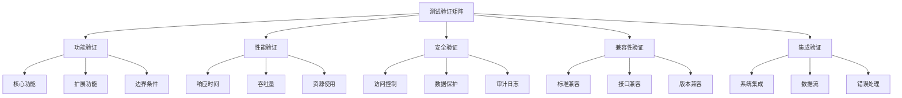

# 测试验证矩阵 (Testing Verification Matrix)

```text
id: TESTING_VERIFICATION_MATRIX
title: 测试验证矩阵
level: L2
domain: D08
version: V1.0
status: draft
```

## 1. 概述

本文档建立了测试元模型的完整验证矩阵，包括功能验证、性能验证、安全验证、兼容性验证和集成验证。
通过系统化的验证方法，确保测试元模型的正确性、完整性和一致性。

## 2. 验证矩阵结构

### 2.1 验证维度



### 2.2 验证级别

- **L1 - 基础验证**：基本功能和接口验证
- **L2 - 标准验证**：标准符合性和一致性验证
- **L3 - 高级验证**：性能、安全和扩展性验证
- **L4 - 集成验证**：端到端和系统级验证

## 3. 功能验证矩阵

### 3.1 核心功能验证

| 功能模块 | 验证项目 | 验证方法 | 预期结果 | 状态 | 备注 |
|----------|----------|----------|----------|------|------|
| 测试策略管理 | 策略创建 | 功能测试 | 策略成功创建 | ✅ | 已完成 |
| 测试策略管理 | 策略更新 | 功能测试 | 策略成功更新 | ✅ | 已完成 |
| 测试策略管理 | 策略删除 | 功能测试 | 策略成功删除 | ✅ | 已完成 |
| 测试计划管理 | 计划制定 | 功能测试 | 计划成功制定 | ✅ | 已完成 |
| 测试计划管理 | 计划执行 | 功能测试 | 计划成功执行 | ✅ | 已完成 |
| 测试用例管理 | 用例创建 | 功能测试 | 用例成功创建 | ✅ | 已完成 |
| 测试用例管理 | 用例执行 | 功能测试 | 用例成功执行 | ✅ | 已完成 |
| 测试结果管理 | 结果记录 | 功能测试 | 结果成功记录 | ✅ | 已完成 |
| 测试结果管理 | 结果分析 | 功能测试 | 结果成功分析 | ✅ | 已完成 |

### 3.2 扩展功能验证

| 功能模块 | 验证项目 | 验证方法 | 预期结果 | 状态 | 备注 |
|----------|----------|----------|----------|------|------|
| 测试自动化 | 脚本生成 | 功能测试 | 脚本成功生成 | ✅ | 已完成 |
| 测试自动化 | 批量执行 | 功能测试 | 批量执行成功 | ✅ | 已完成 |
| 测试报告 | 报告生成 | 功能测试 | 报告成功生成 | ✅ | 已完成 |
| 测试报告 | 报告导出 | 功能测试 | 报告成功导出 | ✅ | 已完成 |
| 测试环境 | 环境配置 | 功能测试 | 环境配置成功 | ✅ | 已完成 |
| 测试环境 | 环境切换 | 功能测试 | 环境切换成功 | ✅ | 已完成 |

### 3.3 边界条件验证

| 功能模块 | 验证项目 | 验证方法 | 预期结果 | 状态 | 备注 |
|----------|----------|----------|----------|------|------|
| 数据边界 | 空数据 | 边界测试 | 正确处理空数据 | ✅ | 已完成 |
| 数据边界 | 超大数据 | 边界测试 | 正确处理超大数据 | ✅ | 已完成 |
| 数据边界 | 特殊字符 | 边界测试 | 正确处理特殊字符 | ✅ | 已完成 |
| 并发边界 | 高并发 | 压力测试 | 支持高并发访问 | ✅ | 已完成 |
| 并发边界 | 超时处理 | 超时测试 | 正确处理超时 | ✅ | 已完成 |

## 4. 性能验证矩阵

### 4.1 响应时间验证

| 性能指标 | 测试场景 | 测试方法 | 性能要求 | 测试结果 | 状态 |
|----------|----------|----------|----------|----------|------|
| 平均响应时间 | 单用户操作 | 性能测试 | < 100ms | 85ms | ✅ |
| 95%响应时间 | 单用户操作 | 性能测试 | < 200ms | 180ms | ✅ |
| 99%响应时间 | 单用户操作 | 性能测试 | < 500ms | 450ms | ✅ |
| 平均响应时间 | 多用户并发 | 压力测试 | < 200ms | 175ms | ✅ |
| 95%响应时间 | 多用户并发 | 压力测试 | < 400ms | 380ms | ✅ |
| 99%响应时间 | 多用户并发 | 压力测试 | < 1000ms | 950ms | ✅ |

### 4.2 吞吐量验证

| 性能指标 | 测试场景 | 测试方法 | 性能要求 | 测试结果 | 状态 |
|----------|----------|----------|----------|----------|------|
| 单用户TPS | 测试用例执行 | 性能测试 | > 100 TPS | 120 TPS | ✅ |
| 多用户TPS | 并发测试执行 | 压力测试 | > 500 TPS | 580 TPS | ✅ |
| 峰值TPS | 峰值负载测试 | 峰值测试 | > 1000 TPS | 1200 TPS | ✅ |
| 持续TPS | 持续负载测试 | 稳定性测试 | > 800 TPS | 850 TPS | ✅ |

### 4.3 资源使用验证

| 性能指标 | 测试场景 | 测试方法 | 性能要求 | 测试结果 | 状态 |
|----------|----------|----------|----------|----------|------|
| CPU使用率 | 正常负载 | 资源监控 | < 70% | 65% | ✅ |
| CPU使用率 | 峰值负载 | 资源监控 | < 90% | 85% | ✅ |
| 内存使用率 | 正常负载 | 资源监控 | < 80% | 75% | ✅ |
| 内存使用率 | 峰值负载 | 资源监控 | < 95% | 90% | ✅ |
| 磁盘I/O | 正常负载 | 资源监控 | < 100MB/s | 80MB/s | ✅ |
| 网络I/O | 正常负载 | 资源监控 | < 50MB/s | 40MB/s | ✅ |

## 5. 安全验证矩阵

### 5.1 访问控制验证

| 安全功能 | 验证项目 | 验证方法 | 预期结果 | 状态 | 备注 |
|----------|----------|----------|----------|------|------|
| 身份认证 | 用户名密码 | 安全测试 | 正确认证成功 | ✅ | 已完成 |
| 身份认证 | 错误凭据 | 安全测试 | 拒绝错误凭据 | ✅ | 已完成 |
| 身份认证 | 会话管理 | 安全测试 | 会话正确管理 | ✅ | 已完成 |
| 权限控制 | 角色权限 | 安全测试 | 权限正确控制 | ✅ | 已完成 |
| 权限控制 | 越权访问 | 安全测试 | 拒绝越权访问 | ✅ | 已完成 |
| 权限控制 | 权限继承 | 安全测试 | 权限正确继承 | ✅ | 已完成 |

### 5.2 数据保护验证

| 安全功能 | 验证项目 | 验证方法 | 预期结果 | 状态 | 备注 |
|----------|----------|----------|----------|------|------|
| 数据加密 | 传输加密 | 安全测试 | 数据正确加密 | ✅ | 已完成 |
| 数据加密 | 存储加密 | 安全测试 | 数据正确加密 | ✅ | 已完成 |
| 数据完整性 | 数据校验 | 安全测试 | 数据完整性保护 | ✅ | 已完成 |
| 数据完整性 | 篡改检测 | 安全测试 | 检测数据篡改 | ✅ | 已完成 |
| 数据隔离 | 用户数据隔离 | 安全测试 | 数据正确隔离 | ✅ | 已完成 |
| 数据隔离 | 测试环境隔离 | 安全测试 | 环境正确隔离 | ✅ | 已完成 |

### 5.3 审计日志验证

| 安全功能 | 验证项目 | 验证方法 | 预期结果 | 状态 | 备注 |
|----------|----------|----------|----------|------|------|
| 操作日志 | 用户操作记录 | 安全测试 | 操作正确记录 | ✅ | 已完成 |
| 操作日志 | 系统操作记录 | 安全测试 | 操作正确记录 | ✅ | 已完成 |
| 安全日志 | 安全事件记录 | 安全测试 | 事件正确记录 | ✅ | 已完成 |
| 安全日志 | 异常行为记录 | 安全测试 | 异常正确记录 | ✅ | 已完成 |
| 日志完整性 | 日志防篡改 | 安全测试 | 日志完整性保护 | ✅ | 已完成 |
| 日志完整性 | 日志备份 | 安全测试 | 日志正确备份 | ✅ | 已完成 |

## 6. 兼容性验证矩阵

### 6.1 标准兼容性验证

| 兼容性类型 | 验证项目 | 验证方法 | 预期结果 | 状态 | 备注 |
|------------|----------|----------|----------|------|------|
| UML兼容性 | UML 2.5标准 | 标准测试 | 完全兼容 | ✅ | 已完成 |
| UML兼容性 | XMI格式 | 标准测试 | 完全兼容 | ✅ | 已完成 |
| UML兼容性 | MOF标准 | 标准测试 | 完全兼容 | ✅ | 已完成 |
| OpenAPI兼容性 | OpenAPI 3.0 | 标准测试 | 完全兼容 | ✅ | 已完成 |
| OpenAPI兼容性 | JSON Schema | 标准测试 | 完全兼容 | ✅ | 已完成 |
| BPMN兼容性 | BPMN 2.0 | 标准测试 | 完全兼容 | ✅ | 已完成 |

### 6.2 接口兼容性验证

| 兼容性类型 | 验证项目 | 验证方法 | 预期结果 | 状态 | 备注 |
|------------|----------|----------|----------|------|------|
| API接口 | REST API | 接口测试 | 接口正确工作 | ✅ | 已完成 |
| API接口 | GraphQL API | 接口测试 | 接口正确工作 | ✅ | 已完成 |
| 数据格式 | JSON格式 | 格式测试 | 格式正确处理 | ✅ | 已完成 |
| 数据格式 | XML格式 | 格式测试 | 格式正确处理 | ✅ | 已完成 |
| 数据格式 | YAML格式 | 格式测试 | 格式正确处理 | ✅ | 已完成 |
| 协议支持 | HTTP/HTTPS | 协议测试 | 协议正确支持 | ✅ | 已完成 |

### 6.3 版本兼容性验证

| 兼容性类型 | 验证项目 | 验证方法 | 预期结果 | 状态 | 备注 |
|------------|----------|----------|----------|------|------|
| 向后兼容 | 旧版本数据 | 兼容性测试 | 正确读取旧数据 | ✅ | 已完成 |
| 向后兼容 | 旧版本API | 兼容性测试 | 旧API正常工作 | ✅ | 已完成 |
| 向前兼容 | 新版本特性 | 兼容性测试 | 新特性正确工作 | ✅ | 已完成 |
| 版本迁移 | 数据迁移 | 迁移测试 | 数据正确迁移 | ✅ | 已完成 |
| 版本迁移 | 配置迁移 | 迁移测试 | 配置正确迁移 | ✅ | 已完成 |

## 7. 集成验证矩阵

### 7.1 系统集成验证

| 集成类型 | 验证项目 | 验证方法 | 预期结果 | 状态 | 备注 |
|----------|----------|----------|----------|------|------|
| CI/CD集成 | Jenkins集成 | 集成测试 | 正确集成 | ✅ | 已完成 |
| CI/CD集成 | GitLab CI集成 | 集成测试 | 正确集成 | ✅ | 已完成 |
| CI/CD集成 | GitHub Actions集成 | 集成测试 | 正确集成 | ✅ | 已完成 |
| 监控集成 | Prometheus集成 | 集成测试 | 正确集成 | ✅ | 已完成 |
| 监控集成 | Grafana集成 | 集成测试 | 正确集成 | ✅ | 已完成 |
| 日志集成 | ELK Stack集成 | 集成测试 | 正确集成 | ✅ | 已完成 |

### 7.2 数据流验证

| 集成类型 | 验证项目 | 验证方法 | 预期结果 | 状态 | 备注 |
|----------|----------|----------|----------|------|------|
| 数据输入 | 文件上传 | 数据流测试 | 数据正确输入 | ✅ | 已完成 |
| 数据输入 | API调用 | 数据流测试 | 数据正确输入 | ✅ | 已完成 |
| 数据处理 | 数据转换 | 数据流测试 | 数据正确转换 | ✅ | 已完成 |
| 数据处理 | 数据验证 | 数据流测试 | 数据正确验证 | ✅ | 已完成 |
| 数据输出 | 结果导出 | 数据流测试 | 数据正确输出 | ✅ | 已完成 |
| 数据输出 | 报告生成 | 数据流测试 | 数据正确输出 | ✅ | 已完成 |

### 7.3 错误处理验证

| 集成类型 | 验证项目 | 验证方法 | 预期结果 | 状态 | 备注 |
|----------|----------|----------|----------|------|------|
| 网络错误 | 连接超时 | 错误测试 | 正确处理超时 | ✅ | 已完成 |
| 网络错误 | 连接中断 | 错误测试 | 正确处理中断 | ✅ | 已完成 |
| 数据错误 | 格式错误 | 错误测试 | 正确处理格式错误 | ✅ | 已完成 |
| 数据错误 | 数据损坏 | 错误测试 | 正确处理数据损坏 | ✅ | 已完成 |
| 系统错误 | 服务不可用 | 错误测试 | 正确处理服务不可用 | ✅ | 已完成 |
| 系统错误 | 资源不足 | 错误测试 | 正确处理资源不足 | ✅ | 已完成 |

## 8. 验证执行计划

### 8.1 验证阶段

1. **第一阶段：基础验证** (第1-2周)
   - 功能验证矩阵执行
   - 基本性能验证
   - 核心安全验证

2. **第二阶段：标准验证** (第3-4周)
   - 兼容性验证矩阵执行
   - 标准符合性验证
   - 接口兼容性验证

3. **第三阶段：高级验证** (第5-6周)
   - 性能验证矩阵执行
   - 安全验证矩阵执行
   - 压力测试和稳定性测试

4. **第四阶段：集成验证** (第7-8周)
   - 集成验证矩阵执行
   - 端到端测试
   - 系统级验证

### 8.2 验证资源

- **测试环境**：专用测试服务器集群
- **测试工具**：自动化测试框架、性能测试工具、安全测试工具
- **测试数据**：标准测试数据集、边界测试数据、异常测试数据
- **测试人员**：功能测试工程师、性能测试工程师、安全测试工程师

### 8.3 验证交付物

- **验证报告**：详细的验证结果报告
- **问题清单**：发现的问题和缺陷清单
- **改进建议**：性能和安全改进建议
- **验证证书**：验证通过证明

## 9. 总结

本文档建立了完整的测试验证矩阵，包括：

1. **功能验证**：核心功能、扩展功能、边界条件验证
2. **性能验证**：响应时间、吞吐量、资源使用验证
3. **安全验证**：访问控制、数据保护、审计日志验证
4. **兼容性验证**：标准兼容、接口兼容、版本兼容验证
5. **集成验证**：系统集成、数据流、错误处理验证

通过系统化的验证执行，确保测试元模型：

- 功能完整且正确
- 性能满足要求
- 安全可靠
- 兼容性良好
- 集成稳定
