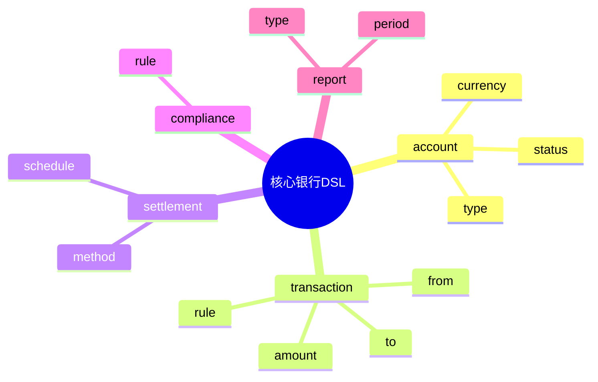

# 核心银行系统DSL草案

## 1. 设计目标
- 用声明式语法描述账户、交易、清算、合规、审计等核心银行流程
- 支持多账户体系、交易类型、合规规则统一建模
- 便于自动生成配置与流程

## 2. 基本语法结构

```dsl
account "user" {
  type = "personal"
  currency = "CNY"
  status = "active"
}

transaction "transfer" {
  from = "user"
  to = "merchant"
  amount = 100
  currency = "CNY"
  rule = "KYC && AML"
}

settlement "internal" {
  method = "netting"
  schedule = "T+1"
}

compliance "kyc" {
  rule = "identity_verified"
}

report "daily_audit" {
  type = "audit"
  period = "1d"
}
```

## 3. 关键元素
- account：账户定义
- transaction：交易定义
- settlement：清算结算配置
- compliance：合规规则
- report：审计报表配置

---

## 4. 示例

```dsl
account "company" {
  type = "corporate"
  currency = "USD"
  status = "frozen"
}

transaction "salary" {
  from = "company"
  to = "user"
  amount = 5000
  currency = "USD"
  rule = "AML"
}

compliance "aml" {
  rule = "amount < 10000 || report_to_regulator"
}
```

---

## 5. 与主流标准的映射

| DSL元素      | Fineract | Mambu | Temenos | Open Banking |
|--------------|----------|-------|---------|--------------|
| account      | account  | account| account | account      |
| transaction  | transaction| transaction| transaction| payment    |
| settlement   | settlement| settlement| settlement| n/a         |
| compliance   | rule     | rule  | rule    | consent      |
| report       | report   | report| report  | statement    |

---

## 6. 递归扩展建议
- 支持多级账户体系与多币种
- 交易与合规规则的统一DSL
- 与支付、风控、区块链等金融基础设施集成

---

## 7. 核心银行DSL关键元素表格

| 元素        | 说明           | 典型属性           |
|-------------|----------------|--------------------|
| account     | 账户定义       | type, currency, status |
| transaction | 交易定义       | from, to, amount, rule |
| settlement  | 清算结算配置   | method, schedule      |
| compliance  | 合规规则       | rule                 |
| report      | 审计报表配置   | type, period         |

---

## 8. 核心银行DSL语法思维导图（Mermaid）



---

## 9. 形式化DSL推理片段

**推论：**  
若 account、transaction、settlement、compliance、report 语法均具备完备性，则任意核心银行业务流程均可通过DSL自动生成配置与推理链路。

**证明思路：**  
- 每个环节均可形式化为DSL声明；
- DSL可自动转化为账户/交易/合规/报表配置；
- 组合DSL可推导出完整的核心银行业务链路。 