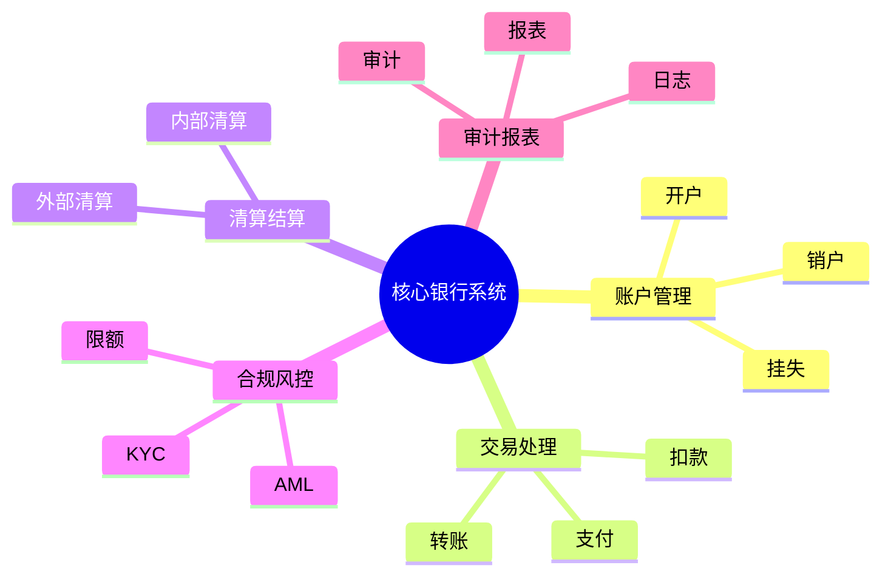

# 核心银行系统理论探讨

## 1. 形式化目标
- 明确核心银行系统的架构、模块、数据流与合规要求
- 支持账户、交易、清算、对账等核心业务的自动化建模
- 为金融行业的高可用、高安全、合规性等场景提供可验证的理论基础

## 2. 核心概念
- 账户管理（Account Management）
- 交易处理（Transaction Processing）
- 清算与结算（Clearing & Settlement）
- 合规与风控（Compliance & Risk Control）
- 审计与报表（Audit & Reporting）

## 3. 主流开源软件/基础设施
- Mambu（云原生核心银行SaaS）
- Apache Fineract（开源核心银行平台）
- Temenos（主流银行核心系统，部分开源组件）
- Open Banking API（开放银行标准）

## 4. 可行性分析
- 账户、交易、清算等流程高度标准化，适合DSL建模
- 合规、风控、审计等可形式化为规则与策略
- 与支付、风控、区块链等可统一为金融基础设施链路

## 5. 自动化价值
- 自动生成账户、交易、清算等配置与流程
- 自动化合规校验与风控规则
- 与AI结合实现智能风控、异常检测、自动报表

## 6. 与AI结合点
- 智能风控与反欺诈
- 自动化合规检测
- 智能报表与数据洞察

## 7. 递归细分方向
- 账户体系建模（Account Modeling）
- 交易流程建模（Transaction Modeling）
- 清算结算建模（Clearing & Settlement）
- 合规风控建模（Compliance & Risk）
- 审计报表建模（Audit & Reporting）

---

## 8. 常见核心银行模块表格

| 模块         | 主要功能           | 典型开源实现           |
|--------------|--------------------|------------------------|
| 账户管理     | 开户、挂失、销户   | Fineract, Mambu        |
| 交易处理     | 转账、支付、扣款   | Fineract, Temenos      |
| 清算结算     | 内部/外部清算      | Fineract, Temenos      |
| 合规风控     | AML、KYC、限额     | Fineract, Rule Engines |
| 审计报表     | 日志、报表、审计   | Fineract, BI工具       |

---

## 9. 核心银行系统建模思维导图（Mermaid）

---

## 10. 形式化推理/论证片段

**定理：**  
若核心银行系统的账户、交易、清算、合规、审计等环节均可形式化建模，则银行核心系统具备可验证性与可自动化推理能力。

**证明思路：**  
1. 账户、交易、清算可用DSL描述数据流与规则；
2. 合规风控可形式化为规则引擎与策略；
3. 审计报表可归约为数据采集与分析链路；
4. 整体流程可组合为可验证的金融基础设施链路。 