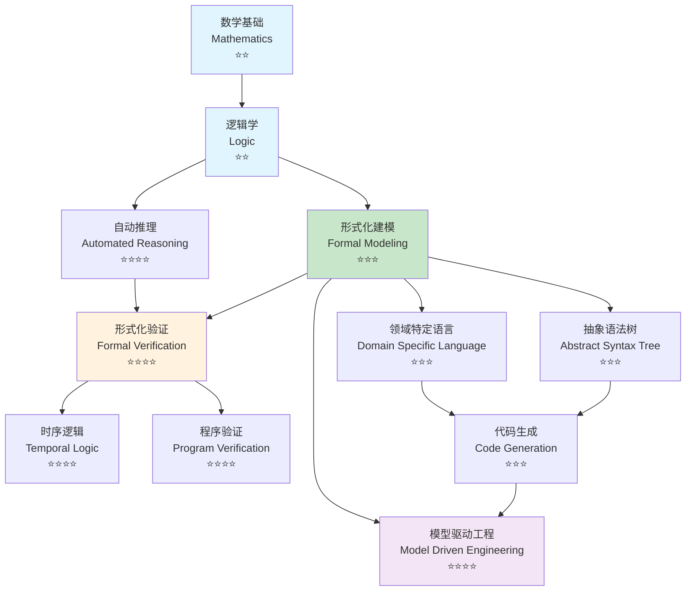
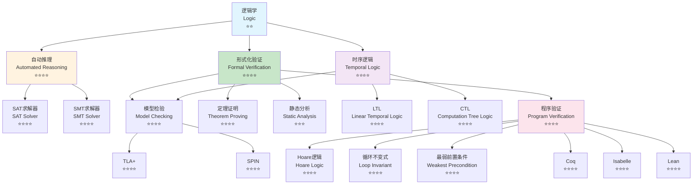
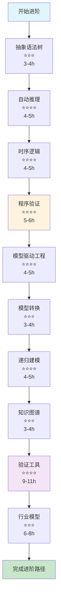
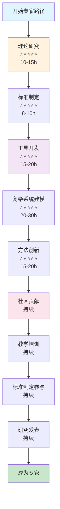

# 形式化框架概念关系图谱 (Concept Relationship Maps)

> **最后更新**: 2025-02-02  
> **维护者**: Formal Framework Team

## 概述

本文档使用Mermaid图可视化形式化框架项目中所有核心概念间的关系，包括概念依赖图、学习路径图和概念分类图。

## 概念依赖关系图

### 基础理论依赖图

**图例说明**：
- ⭐⭐ = 初级难度
- ⭐⭐⭐ = 中级难度
- ⭐⭐⭐⭐ = 高级难度
- 箭头方向 = 依赖方向（前置知识）

### 建模概念依赖图

```mermaid
graph TD
    FormalModeling[形式化建模<br/>Formal Modeling<br/>⭐⭐⭐] --> DataModel[数据模型<br/>Data Model<br/>⭐⭐]
    FormalModeling --> FunctionalModel[功能模型<br/>Functional Model<br/>⭐⭐]
    FormalModeling --> InteractionModel[交互模型<br/>Interaction Model<br/>⭐⭐]
    
    DataModel --> Entity[实体<br/>Entity<br/>⭐⭐]
    DataModel --> Query[查询<br/>Query<br/>⭐⭐]
    DataModel --> Migration[迁移<br/>Migration<br/>⭐⭐⭐]
    
    FunctionalModel --> BusinessLogic[业务逻辑<br/>Business Logic<br/>⭐⭐]
    FunctionalModel --> StateMachine[状态机<br/>State Machine<br/>⭐⭐⭐]
    FunctionalModel --> Workflow[工作流<br/>Workflow<br/>⭐⭐⭐]
    FunctionalModel --> RuleEngine[规则引擎<br/>Rule Engine<br/>⭐⭐⭐]
    
    InteractionModel --> API[API模型<br/>API Model<br/>⭐⭐]
    InteractionModel --> Contract[契约<br/>Contract<br/>⭐⭐⭐]
    InteractionModel --> Message[消息<br/>Message<br/>⭐⭐]
    InteractionModel --> Protocol[协议<br/>Protocol<br/>⭐⭐⭐]
    
    DataModel --> RuntimeModel[运行时模型<br/>Runtime Model<br/>⭐⭐⭐]
    FunctionalModel --> RuntimeModel
    InteractionModel --> RuntimeModel
    
    RuntimeModel --> Container[容器<br/>Container<br/>⭐⭐⭐]
    RuntimeModel --> Orchestration[编排<br/>Orchestration<br/>⭐⭐⭐]
    RuntimeModel --> Network[网络<br/>Network<br/>⭐⭐⭐]
    RuntimeModel --> Storage[存储<br/>Storage<br/>⭐⭐⭐]
    
    RuntimeModel --> DeploymentModel[部署模型<br/>Deployment Model<br/>⭐⭐⭐]
    DeploymentModel --> Infrastructure[基础设施<br/>Infrastructure<br/>⭐⭐⭐]
    DeploymentModel --> Configuration[配置<br/>Configuration<br/>⭐⭐]
    DeploymentModel --> Version[版本<br/>Version<br/>⭐⭐]
    
    RuntimeModel --> MonitoringModel[监控模型<br/>Monitoring Model<br/>⭐⭐⭐]
    MonitoringModel --> Metrics[指标<br/>Metrics<br/>⭐⭐]
    MonitoringModel --> Alerting[告警<br/>Alerting<br/>⭐⭐]
    MonitoringModel --> Logs[日志<br/>Logs<br/>⭐⭐]
    MonitoringModel --> Tracing[追踪<br/>Tracing<br/>⭐⭐⭐]
    
    DataModel --> TestingModel[测试模型<br/>Testing Model<br/>⭐⭐]
    FunctionalModel --> TestingModel
    InteractionModel --> TestingModel
    
    TestingModel --> TestCase[测试用例<br/>Test Case<br/>⭐⭐]
    TestingModel --> Assertion[断言<br/>Assertion<br/>⭐⭐]
    TestingModel --> Coverage[覆盖率<br/>Coverage<br/>⭐⭐⭐]
    
    DeploymentModel --> CICDModel[CI/CD模型<br/>CI/CD Model<br/>⭐⭐⭐]
    TestingModel --> CICDModel
    
    RuntimeModel --> DistributedPattern[分布式模式<br/>Distributed Pattern<br/>⭐⭐⭐⭐]
    InteractionModel --> DistributedPattern
    
    DistributedPattern --> FaultTolerance[容错<br/>Fault Tolerance<br/>⭐⭐⭐⭐]
    DistributedPattern --> Consistency[一致性<br/>Consistency<br/>⭐⭐⭐⭐]
    DistributedPattern --> LoadBalancing[负载均衡<br/>Load Balancing<br/>⭐⭐⭐]
    
    style FormalModeling fill:#c8e6c9
    style DataModel fill:#e1f5fe
    style FunctionalModel fill:#e1f5fe
    style InteractionModel fill:#e1f5fe
    style RuntimeModel fill:#fff3e0
    style DistributedPattern fill:#f3e5f5
```

### 验证概念依赖图

## 学习路径图

### 初学者学习路径

### 进阶学习路径

### 专家学习路径

## 概念分类图

### 按难度分类

```mermaid
graph TD
    Beginner[初级概念<br/>⭐⭐] --> DM[数据模型]
    Beginner --> FM[功能模型]
    Beginner --> IM[交互模型]
    Beginner --> TM[测试模型]
    
    Intermediate[中级概念<br/>⭐⭐⭐] --> AST[抽象语法树]
    Intermediate --> DSL[领域特定语言]
    Intermediate --> CG[代码生成]
    Intermediate --> RM[运行时模型]
    Intermediate --> DM2[部署模型]
    Intermediate --> MM[监控模型]
    
    Advanced[高级概念<br/>⭐⭐⭐⭐] --> AR[自动推理]
    Advanced --> FV[形式化验证]
    Advanced --> TL[时序逻辑]
    Advanced --> PV[程序验证]
    Advanced --> MDE[模型驱动工程]
    Advanced --> DP[分布式模式]
    
    Expert[专家概念<br/>⭐⭐⭐⭐⭐] --> Research[理论研究]
    Expert --> Standards[标准制定]
    Expert --> Tools[工具开发]
    
    style Beginner fill:#c8e6c9
    style Intermediate fill:#fff3e0
    style Advanced fill:#f3e5f5
    style Expert fill:#fce4ec
```

### 按应用领域分类

```mermaid
graph TD
    Foundation[基础理论] --> Math[数学基础]
    Foundation --> Logic[逻辑学]
    Foundation --> FormalModeling[形式化建模]
    
    Modeling[建模方法] --> DataModel[数据模型]
    Modeling --> FunctionalModel[功能模型]
    Modeling --> InteractionModel[交互模型]
    Modeling --> RuntimeModel[运行时模型]
    
    Verification[验证方法] --> FormalVerification[形式化验证]
    Verification --> AutomatedReasoning[自动推理]
    Verification --> ProgramVerification[程序验证]
    Verification --> ModelChecking[模型检验]
    
    Engineering[工程实践] --> CodeGeneration[代码生成]
    Engineering --> MDE[模型驱动工程]
    Engineering --> ModelTransformation[模型转换]
    
    Industry[行业应用] --> CloudNative[云原生]
    Industry --> Finance[金融]
    Industry --> IoT[物联网]
    Industry --> Web3[Web3]
    Industry --> AI[AI基础设施]
    
    style Foundation fill:#e1f5fe
    style Modeling fill:#c8e6c9
    style Verification fill:#fff3e0
    style Engineering fill:#f3e5f5
    style Industry fill:#fce4ec
```

## 概念关系矩阵

### 核心概念关联强度

| 概念A | 概念B | 关联类型 | 关联强度 | 说明 |
|-------|-------|---------|---------|------|
| 形式化建模 | 抽象语法树 | 理论基础 | 强 | AST是形式化建模的数据结构 |
| 形式化建模 | 领域特定语言 | 应用 | 强 | DSL是形式化建模的语言工具 |
| 形式化验证 | 自动推理 | 方法 | 强 | 自动推理是形式化验证的方法 |
| 形式化验证 | 时序逻辑 | 理论 | 强 | 时序逻辑用于系统性质验证 |
| 程序验证 | Hoare逻辑 | 理论 | 强 | Hoare逻辑是程序验证的基础 |
| 代码生成 | 抽象语法树 | 数据结构 | 强 | AST是代码生成的输入 |
| 模型驱动工程 | 代码生成 | 流程 | 强 | 代码生成是MDE的核心步骤 |
| 数据模型 | 功能模型 | 关联 | 中 | 功能模型操作数据模型 |
| 交互模型 | 功能模型 | 关联 | 中 | 交互模型调用功能模型 |
| 运行时模型 | 部署模型 | 关联 | 中 | 部署模型配置运行时模型 |

## 使用指南

### 查找概念关系

1. **查看依赖关系**：使用概念依赖关系图了解学习顺序
2. **查看学习路径**：使用学习路径图规划学习计划
3. **查看分类**：使用概念分类图了解概念组织

### 理解概念难度

- ⭐⭐ = 初级：适合初学者
- ⭐⭐⭐ = 中级：需要一定基础
- ⭐⭐⭐⭐ = 高级：需要扎实基础
- ⭐⭐⭐⭐⭐ = 专家：需要深入研究

### 规划学习路径

1. **初学者**：按照初学者学习路径图学习
2. **进阶学习者**：按照进阶学习路径图学习
3. **专家**：按照专家学习路径图学习

## 相关文档

- [概念索引](../concept-index/CONCEPT_INDEX.md)
- [学习路径](../../LEARNING_PATHS.md)
- [术语表](../glossary/GLOSSARY.md)

---

**维护说明**：本概念关系图谱应定期更新，确保概念关系的准确性和完整性。
