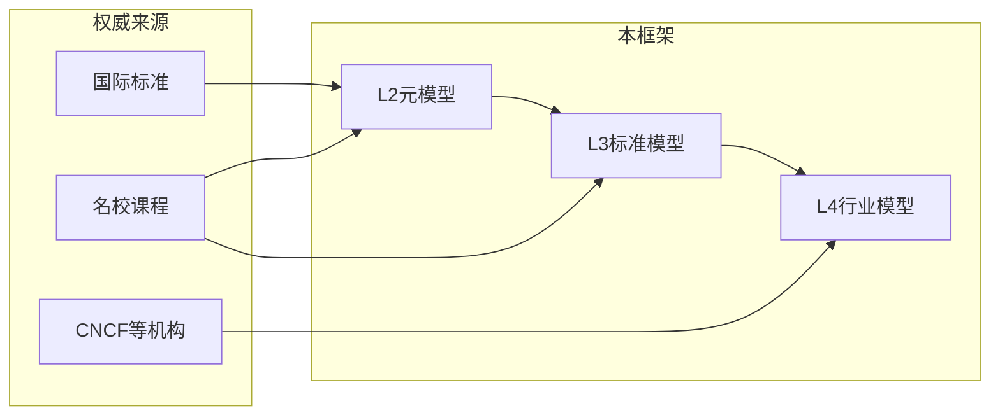

# 权威对标总索引 (Authority Alignment Index)

> 本索引按主题与层次（L2/L3/L4）集中列出国际标准、名校课程与权威机构资源，并注明与本框架的映射关系。便于审稿、持续对齐与学习路径设计。  
> **维护约定**：标准版本与日期建议每季度/年度检查更新；名校课程大纲链接按学期可能变动，**以各校官网为准**（季度检查时建议验证链接，断链任务进 [RECURSIVE_IMPROVEMENT_KANBAN](../RECURSIVE_IMPROVEMENT_KANBAN.md)）。  
> **本表最后核查日期**：2025-02。  
> **框架边界**：本框架侧重软件工程与系统建模的形式化与行业映射，不替代具体实现或运行时系统；形式化覆盖以 L2/L3 规格与不变式为主，不涵盖所有形式化理论（如深度类型论、同伦论等）。审稿与对标时请据此收敛范围。

**本节要点**：（1）国际标准与规范表（含 42010:2022、15288:2023 等）及 evidence 链接；（2）名校课程与 LEARNING_PATHS 映射；（3）CNCF 认证/课程与 L4_D90；（4）行业与 L4 索引映射。年度导出的「标准/课程 ↔ L2/L3 知识点」对照表见 [AUTHORITY_STANDARD_COURSE_L2L3_MATRIX](AUTHORITY_STANDARD_COURSE_L2L3_MATRIX.md)。  
**预计阅读时间**：全文约 15–20 分钟；仅查表约 5 分钟。

## 1. 总览图

## 2. 国际标准与规范

| 标准/规范 | 版本/日期 | 主题 | 本框架映射 | 与 L2/L3 概念映射（要点） | 证据/备注 |
|-----------|-----------|------|------------|---------------------------|-----------|
| ISO/IEC 13568 | 2002 | Z Notation 形式化规范语言 | L2 形式化基础、theory-enhancement | L2 规格与前置条件、不变式 | 规格与前置条件 |
| ISO/IEC 13817 | VDM | Vienna 开发方法 | L2/L3 数据与功能建模 | L2_D02 数据、L2_D03 功能 | 形式化规格 |
| ISO/IEC 15476 / 19505 | UML / UML 2.0 | 统一建模语言 | L2 各元模型、L3 标准模型 | L2 结构/行为视图 → L3 各标准模型 | 结构/行为视图 |
| ISO/IEC 25010 | 2011/现行 | 软件质量模型 | L3_D06 监控、L3_D08 测试、QUALITY_STANDARDS | L3_D06 质量属性、L3_D08 验证 | 质量属性 |
| ISO/IEC 25012 | 现行 | 数据质量模型 | L3_D02 数据标准模型 | L3_D02 数据质量维度 | 数据质量 |
| ISO/IEC 12207 | 2017（**FDIS 新版在批，发布后更新本表**） | 软件生命周期过程 | L3_D09_CICD、practice-guides | L3_D09 流程、生命周期阶段 | evidence:STD-12207 |
| ISO/IEC/IEEE 15288 | 2023 | 系统生命周期过程 | L3 各模型、系统视角 | L3 系统级过程与 L2 元模型对应 | evidence:STD-15288 |
| ISO/IEC/IEEE 24748-2 | 2024 | 15288 应用指南 | 同上 | 与 15288 配套使用 | [evidence:STD-24748](../evidence/STD-24748.md) |
| ISO/IEC 27001 | 2022 | 信息安全管理 | L2_D05 部署/配置安全、L2_D06 监控/审计 | L2_D05/L2_D06 安全与审计 | evidence:STD-27001 |
| IEEE 1471 / ISO/IEC/IEEE 42010 | 2022 | 架构描述（软件、系统与企业） | L3 交互/运行时/部署、架构视图 | L3 视图与视角、架构描述 | evidence:STD-42010 |
| IEEE 830 | 现行 | 软件需求规格说明 | L2 需求相关、L3 契约 | L3_D01 契约、需求可追溯 | 需求 |
| IEEE 1012 | **2024**（2024 批准，发布见 [evidence:STD-1012](../evidence/STD-1012.md)） | 系统、软件与硬件验证和确认 | formal-model/verification、L3_D08 测试 | L3_D08 验证与确认、V&V 过程 | evidence:STD-1012 |
| IEEE/ISO 29119-5 | 2024 | 软件测试 — 关键词驱动测试 | L3_D08 测试 | L3_D08 测试框架、关键字驱动、互操作 | [evidence:STD-29119-5](../evidence/STD-29119-5.md) |
| ISO/IEC/IEEE 24641 | 2023 | 模型驱动系统工程 (MBSSE) 方法与工具 | L2/L3 模型驱动、theory-enhancement | L2/L3 模型驱动过程与工具能力 | [evidence:STD-24641](../evidence/STD-24641.md) |
| BPMN 2.0 | OMG | 业务流程建模 | L3_D03 功能、workflow | L3_D03 工作流、流程 | 流程 |
| SysML 1.6 | OMG | 系统建模语言 | L2/L3 系统视角 | L2 系统结构/行为 | 系统结构 |
| NIST SP 800-190 | 现行 | 容器安全 | L3_D04 运行时、L4_D90 云原生 | L3_D04 容器、L4_D90 安全 | 容器安全 |
| NIST AI RMF / ISO/IEC 23053 / IEEE 2857 | 现行/近年 | AI 风险管理、AI 系统框架、AI 可信度 | L4_D93 AI 基础设施、L3 数据/运行时/测试 | L4_D93 数据管道、模型服务、MLOps、可观测 | L4_D93 已引用；可选建 evidence |
| OpenAPI 3.x | 现行 | API 契约 | L3_D01 交互标准模型、API/Contract | L3_D01 API、契约 | API 设计 |
| TLA+2 | Lamport | 时序逻辑与规约；业界采用见脚注 | theory-enhancement/formal-verification | L2/L3 行为规约、并发 | evidence:STD-TLA |
| Alloy | 现行 | 关系逻辑建模 | theory-enhancement、DSL 分析 | L2 关系与结构、轻量形式化 | evidence:STD-ALLOY |
| ISO/IEC/IEEE DIS 42024 | 草案中（发布后更新） | 企业、系统与软件 — 架构基础（Architecture fundamentals） | L2/L3 架构视角、多域（AI/IoT/云等） | 架构词汇与概念、与 42010 互补 | 待跟踪；发布后建 evidence 并补充映射 |

**待发布/在研标准与待补充课程**：完整清单见 [待跟踪标准与课程](PENDING_TRACKING_STANDARDS_COURSES.md)（含 P12207、24748-3、MIT 形式化相关课程等）；发布或确认后请更新本表并建立/更新 evidence。

**脚注（业界采用）**：TLA+ 业界采用见 AWS、Intel、Microsoft 等；TLA+ Foundation（AWS、Oracle 等）；2024 社区调查要点见 [evidence/STD-TLA](../evidence/STD-TLA.md)。更多标准/方法的业界采用与案例见 [evidence 目录](../evidence/README.md) 及具体条目（如 STD-TLA、STD-ALLOY）。

### 2.1 部分标准与框架映射的简要说明（为何对标）

以下为标准/课程与本框架对标时常用的「为何引用该标准」说明，便于非标准专家读者理解：

- **ISO/IEC/IEEE 42010:2022**（架构描述）：定义软件、系统与企业架构描述的通用概念（视角、视点、利益相关方等），本框架 L3 各模型（交互/运行时/部署等）可视为架构视点下的规格化描述，对标 42010 便于与行业架构实践一致。**架构 vs 架构描述**：42010 区分「架构」（系统本身的关键决策与结构）与「架构描述」（表达该架构的制品，如文档、视图）；本框架 L2/L3 文档即架构描述，各 L3 标准模型对应不同视角下的视图。详见 [evidence:STD-42010](../evidence/STD-42010.md)。
- **ISO/IEC/IEEE 15288:2023**（系统生命周期过程）：定义系统全生命周期的过程与活动（技术管理、技术过程等），本框架 L3 模型与 L3_D09 CI/CD 对应生命周期中的设计、实现、验证、部署等阶段，对标 15288 便于与系统工程与采购方语言对齐。**生命周期与 L3 对应**：15288 的技术过程（如需求、架构定义、实现、验证、部署、运维）与本框架 L3 各标准模型及 [L3_D09 CI/CD 标准模型](../L3_D09_CICD标准模型.md) 的流水线阶段、门禁一一对应；L3_D09 的 Pipeline/Stage/QualityGate 即生命周期阶段的具体化。详见 [evidence:STD-15288](../evidence/STD-15288.md)。
- **IEEE 1012:2024**（验证与确认 V&V）：定义系统、软件与硬件的验证与确认过程与活动，本框架 L3_D08 测试标准模型及 formal-model 中的验证框架与 1012 的 V&V 活动对应，对标 1012 便于满足安全/合规场景下的 V&V 要求。

### 2.2 权威机构规范入口

| 机构 | 范围 | 公开入口（示例） | 与本框架 |
|------|------|------------------|----------|
| OMG | UML、BPMN、SysML、MDA | [omg.org/spec](https://www.omg.org/spec/) | L2/L3 建模语言与流程 |
| NIST | 网络安全、容器、软件供应链 | [nist.gov](https://www.nist.gov/)；容器安全见 NIST SP 800-190 | L3_D04、L4_D90 安全；NIST SP 800-190 与 L3_D04 容器、L4_D90 云原生安全直接对应 |
| ISO/IEC JTC1/SC7 | 软件与系统工程标准 | [iso.org/committee/45144](https://www.iso.org/committee/45144.html) | 12207、15288、25010 等 |
| CNCF | 云原生技术、认证、课程 | [cncf.io/training](https://www.cncf.io/training/) | L4_D90 云原生 |

## 3. 名校课程与教材

以下表格列出课程编号、名称、大纲或链接、与本框架 L2/L3/L4 的映射、以及推荐学习顺序（与 [LEARNING_PATHS.md](../LEARNING_PATHS.md) 对应）。**课程大纲链接最后核查日期**：2025-02；**近期主推**：Stanford CS 357S (2024-2025)、CMU 15-414 (Spring 2024)。

| 机构 | 课程编号 | 课程名称 | 主题 | 本框架映射 | 大纲/链接 | 推荐学习顺序 |
|------|-----------|----------|------|------------|-----------|--------------|
| Stanford | CS 256 | Formal Methods for Reactive Systems | LTL/CTL, model checking | L2/L3 形式化、验证、分布式 | [cs256.stanford.edu](https://cs256.stanford.edu/) | 进阶路径·形式化验证 |
| Stanford | CS 357S | Formal Methods for Computer Systems（**2024-2025 主推**） | SAT/SMT, 定理证明, fuzzing | 验证、测试、形式化 | Stanford Explore Courses | 进阶路径·验证与测试 |
| Stanford | CS 103 | 数学基础 | 离散、逻辑、证明 | L2 数学基础、逻辑 | Stanford Explore Courses | 初学者·阶段1 前置 |
| Stanford | CS 210 | 软件工程 | 工程实践、项目管理 | L3 各模型、practice-guides | Stanford Explore Courses | 初学者·阶段2 后 |
| Stanford | CS 242 | 编程语言 | 类型、语义、DSL | DSL、类型、formal-model | Stanford Explore Courses | 进阶·DSL 与类型 |
| Stanford | CS 238V | Validation of Safety Critical Systems | 时序逻辑规格、falsification、model checking、可达性分析 | L3_D08 测试与验证、安全关键系统 | Stanford Explore Courses / Bulletin | 进阶路径·验证与安全关键 |
| CMU | 15-414 | Bug Catching: Automated Program Verification（**Spring 2024 主推**） | Why3、规约、演绎验证 | L2/L3 形式化验证、规约 | [15414](https://www.cs.cmu.edu/~15414/) | 进阶路径·形式化验证 |
| CMU | 15-311 | Logic and Mechanized Reasoning | SAT/SMT、Lean | L2 逻辑、定理证明 | [15311](https://csd.cmu.edu/course/15311/s24) | 进阶路径·逻辑基础 |
| CMU | 15-317 | 构造逻辑 | 构造逻辑 | L2 逻辑基础 | CMU 课程目录 | 进阶·逻辑 |
| CMU | 15-312 | 编程语言基础 | 类型、语义 | 类型、语义、formal-model | CMU 课程目录 | 进阶·类型论 |
| CMU | 15-413 | 软件工程 | 工程、过程 | L3、行业模型 | CMU 课程目录 | 初学者·阶段2 |
| CMU | 17-712 | Fantastic Bugs and How to Find Them | 软件缺陷与安全漏洞、程序分析、多域（移动/数据库/浏览器/自动驾驶/AI） | L2/L3 验证、测试、程序分析 | [17-712 archives](https://cmu-fantastic-bugs.github.io/archives/s25) | 进阶路径·验证与安全（可选） |
| MIT | 6.042 | 数学基础 | 离散、证明 | L2 数学与逻辑 | MIT OCW | 初学者·阶段1 前置 |
| MIT | 6.170 | 软件工作室 | 架构、实践 | L3、实践 | MIT 课程页 | 初学者·阶段2 |
| MIT | 6.035 | 计算机语言工程 | DSL、编译器、AST | DSL、解析、formal-model | MIT 课程页 | 进阶·DSL |
| Berkeley | CS 70 | 离散数学和概率论 | 离散、概率 | L2 数学基础 | Berkeley EECS | 初学者·阶段1 前置 |
| Berkeley | CS 164 | 编程语言和编译器 | 解析、DSL | DSL、解析、formal-model | Berkeley EECS | 进阶·DSL |
| Berkeley | CS 169 | 软件工程 | CI/CD、敏捷 | L3、CI/CD、实践 | Berkeley EECS | 初学者·阶段2 |
| ETH Zürich | Distributed Systems | 分布式、一致性、容错 | L3_D10、L4 各行业 | L3_D10 分布式模式 | 见 [evidence/COURSE-ETH-DS](../evidence/COURSE-ETH-DS.md) | 行业专项·分布式 |
| Berkeley | EECS 219C | Formal Methods: Specification, Verification, and Synthesis | SAT/SMT、model checking、形式化方法与 AI 安全 | L2/L3 验证、测试、形式化 | [EECS 219C](https://people.eecs.berkeley.edu/~sseshia/219c/) | 进阶路径·验证与综合 |
| UW (Washington) | CSE 507 | Computer-Aided Reasoning for Software Engineering | SAT/SMT、定理证明、模型检验、程序综合 | L2/L3 形式化验证、规约 | [CSE 507](https://courses.cs.washington.edu/courses/cse507/) | 进阶路径·形式化验证 |
| 清华大学 | M510006B / 软件学院 | 软件工程建模与形式化方法 | 形式化建模、函数式验证、TLA+/UPPAAL | L2/L3 建模与验证 | [课程大纲示例](https://formals.lilingkun.com/syllabus.html)；清华软件学院培养方案 | 进阶·形式化与建模 |
| 上海交通大学 | — | 软件工程原理与实践 | 软件架构、工程实践、设计文档 | L3、practice-guides | [SE 模板与资源](https://base.sjtu.edu.cn/se/Templates.html) | 初学者·阶段2 后 |
| ACM/IEEE-CS | CS2023 SE313-FM | 形式化方法（Formal Methods，软件工程专题） | 形式化规格、验证、软件工程课程体系 | L2 逻辑与规格、L3_D08 验证 | [ACM/IEEE-CS 课程建议](https://acm.org/education/curricula-recommendations)、[CS2023](https://csed.acm.org/) | 课程体系对标·形式化方法 |

### 3.1 课程与 LEARNING_PATHS、L2/L3 知识点对应（选列）

| 课程（示例） | 对应 LEARNING_PATHS | L2/L3 知识点 |
|--------------|---------------------|--------------|
| Stanford CS 256 | 进阶路径·阶段1（形式化验证） | LTL/CTL ↔ L2 行为规约、L3_D08 验证 |
| Stanford CS 238V | 进阶路径·验证与安全关键 | 时序逻辑规格、falsification、model checking ↔ L3_D08、安全关键系统 |
| Stanford CS 357S | 进阶路径·阶段3（验证工具） | SAT/SMT、定理证明 ↔ L3_D08、[FORMAL_SPEC_LANGUAGES](FORMAL_SPEC_LANGUAGES.md) |
| CMU 15-414 | 进阶路径·阶段1–3 | Why3、规约、演绎验证 ↔ L2 不变式、L3_D08 |
| CMU 17-712 | 进阶路径·验证与安全（可选） | 软件缺陷与安全、程序分析 ↔ L2/L3 验证、L3_D08 测试 |
| Berkeley EECS 219C | 进阶路径·形式化验证 | 形式化方法与 AI 安全 ↔ L2/L3 验证、L3_D08 |
| MIT 6.042 / Berkeley CS 70 | 初学者·阶段1 前置 | 离散、逻辑、证明 ↔ L2 数学基础 |
| Stanford CS 210 / CMU 15-413 | 初学者·阶段2 后 | 工程实践 ↔ L3 各模型、practice-guides |
| ETH Distributed Systems | 行业专项·分布式 | 分布式、一致性、容错 ↔ L3_D10、L4 各行业 |
| ACM/IEEE-CS CS2023 SE313-FM | 课程体系对标 | 形式化方法专题 ↔ L2 逻辑/规格、L3_D08 验证 |

完整路径与阶段见 [LEARNING_PATHS](../LEARNING_PATHS.md)；复习检查点见 [REVIEW_CHECKLIST](../learning/REVIEW_CHECKLIST.md)。**双向对应**：本表与 LEARNING_PATHS 各阶段总结中的「本阶段与权威对标」一一对应——学习路径中每阶段列出 1–2 条课程/标准，本表提供完整列表与大纲链接；审稿或更新时请同步维护两处。

## 4. 云原生与 CNCF 资源

| 类型 | 名称 | 主题 | 本框架映射 | 链接/备注 |
|------|------|------|------------|-----------|
| 认证 | KCNA | Kubernetes and Cloud Native Associate | L4_D90、容器/基础概念 | [CNCF Certification](https://www.cncf.io/training/certification/) |
| 认证 | CKA | Certified Kubernetes Administrator | L3_D04 运行时、编排 | 同上 |
| 认证 | CKAD | Certified Kubernetes Application Developer | L3_D04、L3_D05 部署 | 同上 |
| 认证 | CKS | Certified Kubernetes Security Specialist | L3_D04 运行时安全、L4_D90 安全 | 同上 |
| 认证 | PCA | Prometheus Certified Associate | L3_D06 监控 | 同上 |
| 认证 | ICA | Istio Certified Associate | L3_D04+L3_D01 服务网格 | 同上 |
| 认证 | CGOA | GitOps Certified Associate | L3_D05 部署、L3_D09 GitOps | 同上 |
| 认证 | CAPA | Certified Argo Project Associate | L3_D05、L3_D09 GitOps/Argo | [CNCF Certification](https://www.cncf.io/training/certification/) |
| 认证 | OTCA | OpenTelemetry Certified Associate | L3_D06 监控、可观测性 | 同上 |
| 认证 | CBA | Certified Backstage Associate | L3_D05 部署、开发者门户 | 同上 |
| 认证 | KCA | Kyverno Certified Associate | L3_D04 策略、L3_D05 合规 | 同上 |
| 认证 | KCSA | Kubernetes and Cloud Native Security Associate | L3_D04、L4_D90 安全 | 同上 |
| 认证 | CNPA | Cloud Native Platform Engineering Associate | L3_D04、L3_D05、L3_D09 平台工程 | 同上 |
| 认证 | CNPE | Certified Cloud Native Platform Engineer | L3_D04/D05/D06/D09 综合 | 同上 |
| 课程 | CNCF Training | 30+ 课程，入门到进阶 | L4_D90 云原生、各子域 | [CNCF Training](https://www.cncf.io/training/courses/) |
| 课程↔L3 | 见 L4_D90 §4.2 | 课程主题与 L3_D04/D05/D06/D09 对应表 | 学完某认证/课程可对标本框架哪几节 | [L4_D90_CN §4.2 CNCF 课程与 L3 映射](../L4_D90_CN_行业索引与对标.md#42-cncf-课程与-l3-映射) |
| 大纲 | cncf/curriculum | 开源认证大纲 | 与 L4_D90、行业 README 案例对照 | [GitHub cncf/curriculum](https://github.com/cncf/curriculum) |
| 项目 | Kubernetes | 容器编排 | L3_D04、evidence:CN-K8S-BASE | kubernetes.io |
| 项目 | Istio | 服务网格 | L3_D04+L3_D01、evidence:CN-ISTIO-TRAFFIC | istio.io |
| 项目 | Prometheus | 监控 | L3_D06、evidence:CN-OBS-OTEL | prometheus.io |
| 项目 | Argo CD | GitOps | L3_D05、L3_D09、evidence:CN-ARGO-GITOPS | argo-cd.readthedocs.io |
| 项目 | Knative | Serverless | L3_D04+L3_D03、evidence:CN-SERVERLESS-KNATIVE | knative.dev |
| 项目 | Envoy | 代理/网关 | L3_D01、L3_D04、evidence:CN-API-ENVOY | envoyproxy.io |

## 5. 行业与 L4 索引映射

| 行业 | L4 索引文档 | 权威对标侧重 | 本仓库路径 |
|------|-------------|--------------|------------|
| 云原生 | L4_D90_CN_行业索引与对标 | CNCF、Kubernetes/Istio/Prometheus/Argo/Knative/Envoy | docs/L4_D90_CN_行业索引与对标.md、industry-model/cloud-native-architecture/ |
| 金融 | L4_D91_FIN_行业索引与对标 | PCI-DSS、Open Banking、巴塞尔、Fineract | docs/L4_D91_FIN_行业索引与对标.md、industry-model/finance-architecture/ |
| 物联网 | L4_D92_IOT_行业索引与对标 | EdgeX、KubeEdge、EMQX、OPC UA、LwM2M | docs/L4_D92_IOT_行业索引与对标.md、industry-model/iot-architecture/ |
| AI 基础设施 | L4_D93_AI_行业索引与对标 | TensorFlow Serving、Feast、Kubeflow、MLflow、Airflow | docs/L4_D93_AI_行业索引与对标.md、industry-model/ai-infrastructure-architecture/ |
| Web3 | L4_D94_W3_行业索引与对标 | Ethereum、Solidity、Chainlink、Polkadot、IPFS、DID/VC | docs/L4_D94_W3_行业索引与对标.md、industry-model/web3-architecture/ |

## 6. 使用说明

- **审稿**：检查文档中「与权威来源对应」时，可据此表核对标准号、课程名、CNCF 资源是否一致。
- **如何用本表审稿**：审稿时（1）检查文档中引用的标准/课程是否在本表及 [evidence](../evidence/README.md) 中存在；（2）核对版本与日期是否与本表一致（如 IEEE 1012 是否为 2024）；（3）表中「证据/备注」列使用 evidence:ID 格式的，应在 evidence 目录下有对应条目，且该条目可注明「被本索引引用」便于双向追溯。
- **学习路径**：结合 [LEARNING_PATHS.md](../LEARNING_PATHS.md) 与上表，按 L2→L3→L4 选择对应课程或认证大纲。
- **业界采用**：标准与课程之外，形式化方法及工具的工业实践（如 TLA+、Alloy 等）见 [evidence 目录](../evidence/README.md) 及对应 STD-* 条目，便于从标准到实践贯通。
- **持续更新**：课程链接与大纲、CNCF 认证列表、标准修订建议按季度或年度更新；**课程大纲链接最后核查**：建议每季度检查 2–3 门主推课程（如 CS 357S、15-414）链接可访问性并更新本表脚注或「本表最后核查日期」；新增证据条目见 [evidence/README.md](../evidence/README.md)。
- **待跟踪清单**：待发布/在研标准及待补充课程见 [PENDING_TRACKING_STANDARDS_COURSES.md](PENDING_TRACKING_STANDARDS_COURSES.md)，便于下周期补全本表与 evidence。

---

**维护**：与 docs/README.md、reference/README.md、各 L4 行业索引及 evidence 目录同步。  
**最后更新**：随项目 CHANGELOG 维护。
