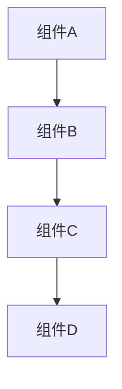

# [案例名称] 端到端示例

## 📋 基本信息

- **案例名称**：[中文名称] / [English Name]
- **案例类型**：[云原生/金融/AI基础设施/IoT/Web3]
- **复杂度**：[初级/中级/高级]
- **预计时间**：[X小时]
- **版本**：v[版本号]
- **创建日期**：[YYYY-MM-DD]
- **最后更新**：[YYYY-MM-DD]
- **维护者**：[维护者姓名]

## 🎯 案例概述

### 目标
[描述案例的目标和预期成果]

### 适用场景
[描述案例适用的业务场景]

### 技术栈
[列出案例使用的技术栈]

| 技术类别 | 技术名称 | 版本 | 用途 |
|----------|----------|------|------|
| [类别1] | [技术1] | [版本] | [用途] |
| [类别2] | [技术2] | [版本] | [用途] |

## 📐 架构设计

### 系统架构图


### 组件说明
| 组件名称 | 类型 | 描述 | 职责 |
|----------|------|------|------|
| [组件1] | [类型] | [描述] | [职责] |
| [组件2] | [类型] | [描述] | [职责] |

### 数据流
[描述数据在系统中的流动过程]

## 🚀 环境准备

### 前置要求
- [ ] [要求1]
- [ ] [要求2]
- [ ] [要求3]

### 工具安装
```bash
# 安装示例
curl -fsSL https://example.com/install.sh | bash
```

### 环境配置
```bash
# 配置示例
export ENV_VAR=value
```

## 📦 部署步骤

### 步骤1：[步骤名称]
```bash
# 命令示例
command --option value
```

**验证方法**：
```bash
# 验证命令
verify_command
```

### 步骤2：[步骤名称]
```bash
# 命令示例
command --option value
```

**验证方法**：
```bash
# 验证命令
verify_command
```

### 步骤3：[步骤名称]
```bash
# 命令示例
command --option value
```

**验证方法**：
```bash
# 验证命令
verify_command
```

## 🔧 配置说明

### 配置文件
```yaml
# 配置示例
service:
  name: example-service
  port: 8080
  environment: production
```

### 环境变量
| 变量名 | 默认值 | 描述 |
|--------|--------|------|
| [变量1] | [默认值] | [描述] |
| [变量2] | [默认值] | [描述] |

## 🧪 测试验证

### 功能测试
```bash
# 测试脚本
#!/bin/bash
echo "开始功能测试..."
# 测试逻辑
```

### 性能测试
```bash
# 性能测试脚本
#!/bin/bash
echo "开始性能测试..."
# 性能测试逻辑
```

### 集成测试
```bash
# 集成测试脚本
#!/bin/bash
echo "开始集成测试..."
# 集成测试逻辑
```

## 📊 验证结果

### 功能验证
| 功能点 | 预期结果 | 实际结果 | 状态 |
|--------|----------|----------|------|
| [功能1] | [预期] | [实际] | [状态] |
| [功能2] | [预期] | [实际] | [状态] |

### 性能指标
| 指标名称 | 目标值 | 实际值 | 单位 | 状态 |
|----------|--------|--------|------|------|
| [指标1] | [目标] | [实际] | [单位] | [状态] |
| [指标2] | [目标] | [实际] | [单位] | [状态] |

### 监控数据
```json
{
  "timestamp": "2024-12-19T10:00:00Z",
  "metrics": {
    "cpu_usage": "45%",
    "memory_usage": "60%",
    "response_time": "120ms"
  }
}
```

## 🔍 故障排除

### 常见问题
| 问题描述 | 可能原因 | 解决方案 |
|----------|----------|----------|
| [问题1] | [原因1] | [解决方案1] |
| [问题2] | [原因2] | [解决方案2] |

### 日志分析
```bash
# 查看日志
kubectl logs -f deployment/example-service
```

### 调试命令
```bash
# 调试命令
kubectl describe pod example-pod
```

## 📚 扩展阅读

### 相关文档
- [文档1链接](path/to/doc1.md)
- [文档2链接](path/to/doc2.md)

### 最佳实践
- [实践1链接](path/to/practice1.md)
- [实践2链接](path/to/practice2.md)

### 社区资源
- [资源1链接](external/link1)
- [资源2链接](external/link2)

## 🔄 版本历史

| 版本 | 日期 | 变更内容 | 变更人 |
|------|------|----------|--------|
| v1.0.0 | [日期] | 初始版本 | [姓名] |
| v1.1.0 | [日期] | [变更内容] | [姓名] |

## 📞 联系方式

- **维护者**：[姓名] <[邮箱]>
- **技术支持**：[邮箱]
- **问题反馈**：[GitHub Issues链接]

---

*模板版本：v1.0.0*
*最后更新：2024-12-19*
